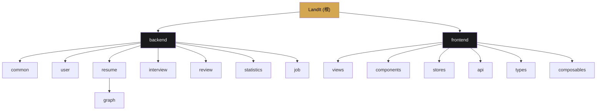

# CLAUDE.md

This file provides guidance to Claude Code (claude.ai/code) when working with code in this repository.

---

# LandIt - 智能求职助手

> **项目名称含义**：LandIt = Land the job（拿下工作）

---

## 变更记录 (Changelog)

| 日期 | 版本 | 变更内容 |
|------|------|----------|
| 2026-03-08 | 1.3.0 | AI 上下文更新：简化工作流结构、更新组件清单、补充 composables 文档 |
| 2026-03-06 | 1.2.0 | 从 DashScope Starter 迁移到 OpenAI Starter |
| 2026-03-03 | 1.1.0 | AI 上下文初始化：更新模块索引、添加 Mermaid 结构图、完善工作流文档 |
| 2026-02-19 | 1.0.0 | 初始版本：项目基础架构文档 |

---

## 项目愿景

LandIt 是一款面向求职者的全流程智能助手工具，旨在帮助用户：
- 管理和优化求职简历
- 进行模拟面试训练
- 对面试表现进行深度复盘分析
- 获取个性化职位推荐
- 跟踪求职进度与能力提升

---

## 架构总览

本项目采用**前后端分离**架构：

```
+------------------+          HTTP/REST          +------------------+
|                  |  <----------------------->  |                  |
|    Frontend      |      /landit/*             |    Backend       |
|    Vue 3 + TS    |                             |   Spring Boot    |
|    Vite 5        |                             |   MyBatis-Plus   |
|                  |                             |   SQLite         |
+------------------+                             +------------------+
       |                                                |
       v                                                v
+------------------+                             +------------------+
|  Pinia Store     |                             |   SQLite DB      |
|  Mock Data       |                             |   landit.db      |
+------------------+                             +------------------+
```

---

## 模块结构图



---

## 模块索引

| 模块 | 路径 | 语言/框架 | 职责 | 文档 |
|------|------|----------|------|------|
| **Backend** | `backend/` | Java 17 + Spring Boot 3.5.11 | 后端API服务 | [详情](./backend/CLAUDE.md) |
| **Frontend** | `frontend/` | TypeScript + Vue 3.4 | 前端SPA应用 | [详情](./frontend/CLAUDE.md) |

### 后端子模块

| 子模块 | 路径 | 职责 |
|--------|------|------|
| common | `backend/.../common/` | 基础实体、枚举、配置、统一响应、Schema构建、AI提示词配置 |
| user | `backend/.../user/` | 用户信息管理 |
| resume | `backend/.../resume/` | 简历CRUD、AI优化、导出 |
| resume/graph | `backend/.../resume/graph/` | 简历优化工作流（StateGraph 状态机） |
| interview | `backend/.../interview/` | 面试会话、题库、答题流程 |
| review | `backend/.../review/` | 面试复盘、维度分析、改进计划 |
| statistics | `backend/.../statistics/` | 数据统计与可视化 |
| job | `backend/.../job/` | 职位推荐 |

---

## 技术栈

### 后端
- **框架**：Spring Boot 3.5.11 + Java 17
- **ORM**：MyBatis-Plus 3.5.9
- **数据库**：SQLite（文件存储于 `backend/data/landit.db`）
- **AI 集成**：Spring AI OpenAI（支持 OpenAI 协议的模型）
- **工作流引擎**：Spring AI Alibaba Agent Framework（状态机 Graph）
- **文档处理**：Apache PDFBox 3.0.4（PDF）、Apache POI 5.3.0（Word）
- **对象映射**：MapStruct 1.6.3
- **工具库**：Lombok、Hutool 5.8.34
- **API 文档**：SpringDoc OpenAPI（访问 `/landit/swagger-ui.html`）

### 前端
- **框架**：Vue 3.4 + TypeScript 5.4
- **构建工具**：Vite 5
- **状态管理**：Pinia 2.1
- **路由**：Vue Router 4.3
- **样式**：SCSS + 全局变量系统
- **工具库**：@vueuse/core

---

## 常用命令

### 后端
```bash
cd backend
mvn spring-boot:run          # 启动开发服务器（端口 8080）
mvn clean package            # 构建生产包
mvn clean compile            # 仅编译
```

### 前端
```bash
cd frontend
npm run dev                  # 启动开发服务器（Vite 默认端口 5173）
npm run build                # 构建生产包（含类型检查）
npm run type-check           # 仅执行 TypeScript 类型检查
npm run preview              # 预览构建结果
```

---

## 核心架构模式

### 简历优化工作流 Graph（Resume Optimization Workflow）

简历优化功能基于 **Spring AI Alibaba Agent Framework** 构建状态机工作流：

```
+------------------------------------------------------------------------------+
|                        ResumeOptimizeGraph                                    |
+------------------------------------------------------------------------------+
|                                                                              |
|   START --> DiagnoseQuick --> GenerateSuggestions --> OptimizeSection --> END|
|              (快速诊断)           (生成建议)              (内容优化)           |
|                                                                              |
+------------------------------------------------------------------------------+
```

**关键组件：**

| 组件 | 位置 | 职责 |
|------|------|------|
| `ResumeOptimizeGraphConfig` | `resume/graph/` | 定义工作流节点、边、状态策略 |
| `ResumeOptimizeGraphService` | `resume/graph/` | 执行、恢复、状态管理工作流 |
| `ResumeOptimizeGraphConstants` | `resume/graph/` | 统一管理状态键、节点名称等常量 |
| `DiagnoseResumeNode` | `resume/graph/` | 快速诊断简历问题（评分、建议） |
| `GenerateSuggestionsNode` | `resume/graph/` | 生成优化建议 |
| `OptimizeSectionNode` | `resume/graph/` | 优化具体模块内容 |

**工作流特性：**
- **简化流程**：三步完成优化（诊断 -> 建议 -> 优化）
- **流式执行**：支持 SSE 实时推送节点输出
- **状态持久化**：MemorySaver 存储工作流状态（生产环境应替换为 Redis）

**状态键定义：**

| 状态键 | 类型 | 描述 |
|--------|------|------|
| `resume_content` | Replace | 简历内容（JSON格式） |
| `diagnosis_mode` | Replace | 诊断模式（quick） |
| `diagnosis_result` | Replace | 诊断结果（JSON格式） |
| `suggestions` | Replace | 优化建议（JSON格式） |
| `selected_suggestions` | Append | 用户选择的建议 |
| `optimized_sections` | Replace | 优化后的简历内容 |
| `messages` | Append | 消息日志 |

### 职位适配工作流 Graph（Resume Tailor Workflow）

职位适配功能基于 **Spring AI Alibaba Agent Framework** 构建状态机工作流：

```
+------------------------------------------------------------------------------+
|                        TailorResumeGraph                                      |
+------------------------------------------------------------------------------+
|                                                                              |
|   START --> AnalyzeJD --> MatchResume --> GenerateTailored --> END          |
|              (分析JD)     (匹配简历)       (生成定制简历)                      |
|                                                                              |
+------------------------------------------------------------------------------+
```

**关键组件：**

| 组件 | 位置 | 职责 |
|------|------|------|
| `TailorResumeGraphConfig` | `resume/graph/` | 定义工作流节点、边、状态策略 |
| `TailorResumeGraphService` | `resume/graph/` | 执行、恢复、状态管理工作流 |
| `TailorResumeGraphConstants` | `resume/graph/` | 统一管理状态键、节点名称等常量 |
| `AnalyzeJDNode` | `resume/graph/` | 分析职位描述，提取必备技能、关键词等 |
| `MatchResumeNode` | `resume/graph/` | 匹配简历与 JD，计算匹配度 |
| `GenerateTailoredResumeNode` | `resume/graph/` | 根据匹配分析生成定制简历 |

**工作流特性：**
- **智能定制**：根据 JD 自动调整简历内容
- **流式执行**：支持 SSE 实时推送节点输出
- **状态持久化**：MemorySaver 存储工作流状态

**状态键定义：**

| 状态键 | 类型 | 描述 |
|--------|------|------|
| `resume_content` | Replace | 简历内容（JSON格式） |
| `target_position` | Replace | 目标职位 |
| `job_description` | Replace | 职位描述 |
| `job_requirements` | Replace | JD 分析结果 |
| `match_analysis` | Replace | 匹配分析结果 |
| `tailored_resume` | Replace | 定制简历结果 |

### 区块类型系统（Section Type System）

简历模块采用**区块类型系统**实现动态简历结构解析：

```
+-----------------+     +----------------------+     +---------------------+
|  SectionType    |---->| SectionSchemaRegistry |---->|  JsonSchemaBuilder  |
|  (枚举定义)      |     |  (动态Schema组装)      |     |  (Schema构建工具)    |
+-----------------+     +----------------------+     +---------------------+
         |                        |
         v                        v
+-----------------+     +----------------------+
|  schemaClass    |     |  AI解析JSON Schema    |
|  (DTO类型映射)   |     |  (OpenAI协议模型)     |
+-----------------+     +----------------------+
```

**关键组件：**

| 组件 | 位置 | 职责 |
|------|------|------|
| `SectionType` | `common/enums/` | 定义 9 种区块类型（基本信息、教育、工作、项目、技能、证书、开源贡献、自定义、原始文本） |
| `SectionSchemaRegistry` | `common/schema/` | 根据 SectionType 动态构建完整简历 JSON Schema |
| `GraphSchemaRegistry` | `common/schema/` | 工作流节点 Schema 构建器 |
| `JsonSchemaBuilder` | `common/util/` | 提供流畅的 Schema 构建接口 |
| `SchemaGenerator` | `common/util/` | 从 Class 生成 JSON Schema |
| `@SchemaField` | `common/annotation/` | 标记 DTO 字段的 Schema 元数据 |
| `ResumeStructuredData` | `resume/dto/` | 结构化简历数据容器，包含所有区块类型的内部类 |

**区块类型定义：**

| SectionType | schemaClass | 聚合类型 | 描述 |
|-------------|-------------|----------|------|
| BASIC_INFO | BasicInfo.class | 单对象 | 基本信息 |
| EDUCATION | EducationExperience.class | 数组 | 教育经历 |
| WORK | WorkExperience.class | 数组 | 工作经历 |
| PROJECT | ProjectExperience.class | 数组 | 项目经验 |
| SKILLS | Skill.class | 数组 | 专业技能 |
| CERTIFICATE | Certificate.class | 数组 | 证书荣誉 |
| OPEN_SOURCE | OpenSourceContribution.class | 数组 | 开源贡献 |
| CUSTOM | CustomSection.class | 数组 | 自定义区块 |
| RAW_TEXT | null | - | 原始文本（不参与Schema） |

### API 统一响应格式
```json
{
  "code": 200,
  "message": "success",
  "data": <T>,
  "timestamp": 1708329600000
}
```

### 后端上下文路径
所有 API 请求前缀：`/landit`
- 示例：`http://localhost:8080/landit/user/profile`

### 数据库特性
- 使用 SQLite 文件数据库，无需额外服务
- 主键策略：雪花算法（ASSIGN_ID）
- 逻辑删除字段：`deleted`（0=未删除，1=已删除）
- 自动填充：`createdAt`（插入）、`updatedAt`（插入+更新）

---

## 数据库表结构

| 表名 | 实体类 | 描述 |
|------|--------|------|
| t_user | User | 用户信息 |
| t_resume | Resume | 简历主表 |
| t_resume_version | - | 简历历史版本（快照） |
| t_resume_section | ResumeSection | 简历模块（区块） |
| t_resume_suggestion | ResumeSuggestion | 简历优化建议 |
| t_interview | Interview | 面试记录 |
| t_interview_question | InterviewQuestion | 面试题库 |
| t_interview_session | InterviewSession | 面试会话 |
| t_conversation | Conversation | 面试对话 |
| t_interview_review | InterviewReview | 面试复盘 |
| t_review_dimension | ReviewDimension | 复盘维度 |
| t_question_analysis | QuestionAnalysis | 问题分析 |
| t_improvement_plan | ImprovementPlan | 改进计划 |
| t_job | Job | 职位推荐 |

---

## API 清单

### 用户模块 `/user`
| 方法 | 路径 | 描述 |
|------|------|------|
| GET | /status | 获取用户状态（是否存在） |
| POST | /init | 初始化用户（上传简历） |
| GET | /profile | 获取当前用户信息 |
| PUT | /profile | 更新用户信息 |
| POST | /avatar | 上传头像 |

### 简历模块 `/resumes`
| 方法 | 路径 | 描述 |
|------|------|------|
| GET | / | 获取简历列表 |
| GET | /primary | 获取主简历 |
| POST | / | 创建空白简历 |
| POST | /upload | 上传简历文件 |
| POST | /parse | 解析简历文件为图片列表 |
| GET | /{id} | 获取简历详情 |
| PUT | /{id} | 更新简历 |
| DELETE | /{id} | 删除简历 |
| PUT | /{id}/primary | 设置主简历 |
| GET | /{id}/versions | 获取版本历史 |
| GET | /{id}/versions/{version} | 获取指定版本详情 |
| POST | /{id}/rollback/{version} | 回滚到指定版本 |
| POST | /{id}/derive | 派生岗位定制简历 |
| GET | /{id}/export | 导出简历PDF |
| PUT | /{id}/sections/{sectionId} | 更新简历模块 |
| POST | /{id}/sections | 新增简历模块 |
| DELETE | /{id}/sections/{sectionId} | 删除简历模块 |

### 简历优化工作流 `/resumes`
| 方法 | 路径 | 描述 |
|------|------|------|
| GET | /{id}/optimize/stream | SSE流式执行简历优化 |
| POST | /{id}/optimize | 同步执行简历优化 |
| GET | /workflow/state | 获取工作流状态 |
| POST | /workflow/review | 提交人工审核结果 |
| POST | /workflow/resume | 恢复工作流执行 |

### 面试模块 `/interviews`
| 方法 | 路径 | 描述 |
|------|------|------|
| POST | /sessions | 开始面试会话 |
| POST | /sessions/{sessionId}/answers | 提交回答 |
| GET | /sessions/{sessionId}/hints | 请求提示 |
| POST | /sessions/{sessionId}/finish | 结束面试 |
| GET | /history | 获取面试历史 |
| GET | /{id} | 获取面试详情 |
| GET | /questions | 获取题库 |

### 复盘模块 `/reviews`
| 方法 | 路径 | 描述 |
|------|------|------|
| GET | / | 获取复盘列表 |
| GET | /{id} | 获取复盘详情 |
| GET | /{id}/export | 导出复盘报告 |

### 统计模块 `/statistics`
| 方法 | 路径 | 描述 |
|------|------|------|
| GET | / | 获取统计数据 |

### 职位模块 `/jobs`
| 方法 | 路径 | 描述 |
|------|------|------|
| GET | /recommendations | 获取推荐职位 |

---

## 编码规范

### Java 后端
1. 所有类添加 `@author Azir` 注释
2. 使用 `@RequiredArgsConstructor` + `private final` 进行构造注入
3. Service 接口继承 `IService<T>`
4. 避免在 Controller 中写业务逻辑
5. 简单查询使用 MyBatis-Plus 条件构造器，复杂联查使用 XML

### TypeScript 前端
1. 所有类型定义集中在 `types/index.ts` 和 `types/resume-optimize.ts`
2. 使用 Composition API + `<script setup>`
3. 状态管理使用 Pinia Store

---

## AI 使用指引

### 开发建议
1. 修改代码后同步更新 `CLAUDE.md` 文档
2. 新增 API 需在 `openapi.yaml` 中定义 Schema
3. 新增数据库表需更新 `schema.sql`
4. 新增简历区块类型需更新 `SectionType` 枚举和对应 DTO
5. 新增工作流节点需：
   - 在 `resume/graph/` 下创建 Node 类（实现 AsyncNodeAction 接口）
   - 在 `ResumeOptimizeGraphConfig` 中注册节点和边
   - 在 `ResumeOptimizeGraphConstants` 中定义状态常量
   - 在 `resumeOptimizeKeyStrategyFactory` 中添加状态策略

### 上下文文件
- **API 定义**：`backend/docs/openapi.yaml`
- **数据库结构**：`backend/src/main/resources/schema.sql`
- **前端类型**：`frontend/src/types/index.ts`、`frontend/src/types/resume-optimize.ts`
- **设计系统**：`frontend/src/assets/styles/variables.scss`
- **区块类型**：`backend/src/main/java/com/landit/common/enums/SectionType.java`
- **工作流配置**：`backend/src/main/java/com/landit/resume/graph/ResumeOptimizeGraphConfig.java`
- **工作流常量**：`backend/src/main/java/com/landit/resume/graph/ResumeOptimizeGraphConstants.java`
- **AI 提示词配置**：`backend/src/main/java/com/landit/common/config/AIPromptProperties.java`
- **Schema 注册表**：`backend/src/main/java/com/landit/common/schema/SectionSchemaRegistry.java`

---

## 测试策略

**当前状态**：项目暂无测试文件

**建议补充**：
1. 后端单元测试：`backend/src/test/java/com/landit/`
   - Service 层业务逻辑测试
   - 工作流节点测试
   - Schema 构建测试
2. 前端组件测试：`frontend/src/__tests__/`
   - Pinia Store 测试
   - 组件渲染测试
   - API 调用测试

---

## 覆盖率报告

| 区域 | 状态 | 覆盖率 | 说明 |
|------|------|--------|------|
| 后端 Controllers | 已扫描 | 100% | 7个控制器全部识别 |
| 后端 Services | 已扫描 | 100% | 7个服务类全部识别 |
| 后端 Graph 节点 | 已扫描 | 100% | 3个工作流节点全部识别 |
| 前端 Views | 已扫描 | 100% | 9个页面组件全部识别 |
| 前端 Components | 已扫描 | 100% | 17个组件全部识别 |
| 前端 Composables | 已扫描 | 100% | 3个组合式函数全部识别 |
| 数据库 Schema | 已扫描 | 100% | 14张表全部识别 |
| API 文档 | 已扫描 | 100% | OpenAPI 3.0 定义完整 |
| 测试文件 | 未发现 | 0% | 建议补充 |

---

## 常见问题 (FAQ)

### Q: 如何启动项目？
A:
1. 后端：`cd backend && mvn spring-boot:run`
2. 前端：`cd frontend && npm run dev`
3. 需要配置环境变量 `OPENAI_API_KEY` 用于 AI 功能

### Q: 如何添加新的工作流节点？
A:
1. 在 `resume/graph/` 下创建 Node 类，实现 `AsyncNodeAction` 接口
2. 在 `ResumeOptimizeGraphConstants` 中定义节点名称常量
3. 在 `ResumeOptimizeGraphConfig` 中使用 `addNode()` 注册节点
4. 在 `resumeOptimizeKeyStrategyFactory` 中添加节点需要的状态策略
5. 使用 `addEdge()` 或 `addConditionalEdges()` 连接节点

### Q: 如何使用简历优化功能？
A: 前端使用 `useResumeOptimize` composable：
```typescript
import { useResumeOptimize } from '@/composables/useResumeOptimize'

const { startOptimize, state, stageHistory } = useResumeOptimize()
startOptimize(resumeId, 'quick', targetPosition)
```

---
