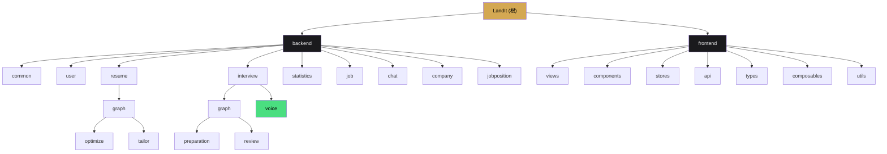

# CLAUDE.md

This file provides guidance to Claude Code (claude.ai/code) when working with code in this repository.

---

# LandIt - 智能求职助手

> **项目名称含义**：LandIt = Land the job（拿下工作）

---

## 变更记录 (Changelog)

| 日期 | 版本 | 变更内容 |
|------|------|----------|
| 2026-04-07 | 2.4.0 | **清理老版本复盘模块**：删除 `backend/.../review/` 目录（13 个 Java 文件）、4 张老版本复盘表、前端 Review.vue/ReviewDetail.vue 视图；复盘功能统一使用 `interview/graph/review/` 工作流 + `InterviewReviewNote` |
| 2026-04-02 | 2.3.1 | **AI 上下文增量更新**：新增 useStreamAssist composable（SSE 流式求助）；更新前端 Composables 数量（17->18）；更新覆盖率报告 |
| 2026-04-02 | 2.3.0 | **新增 AI 语音面试模块**（feat/ai-chat-voice 分支）：WebSocket 实时语音对话 + 阿里云 ASR/TTS + 求助系统 + 录音回放；后端新增 interview/voice 子模块（37 个 Java 文件）、company/jobposition 模块；前端新增语音面试组件（6 个）+ 录音回放组件（2 个）+ Composables（3 个）+ API/Types；数据库新增 3 张语音面试表；更新模块结构图 |
| 2026-04-01 | 2.2.0 | 新增面试中心模块文档（真实面试管理 + 准备工作流 + 复盘分析工作流）；前端新增 interview-center 组件（7个）+ Composables（2个）+ API/Types |
| 2026-03-30 | 2.1.0 | AI 上下文增量更新：新增 BaseGraphConstants 公共常量基类、Graph 子包重组（optimize/tailor）；前端新增 ImagePreviewModal/AIIcon 组件（common 组件 3->5）、stageHelpers 工具函数、ResumeSuggestionsGroup 组件；ChatEvent 新增 resume_selected 事件；AIChatState 新增 hideFloat 字段；测试文件增至 2 个；精确统计 180 Java 文件、67 Vue 组件、28 TS 文件 |
| 2026-03-30 | 2.0.0 | 新增 AI Chat 模块文档（ReactAgent + 技能系统 + 8个工具）；更新文件统计（181 Java、73 Vue、12 Composables、5 Types）；新增 t_chat_message 表；新增前端聊天组件目录 |
| 2026-03-18 | 1.5.0 | AI 上下文全面扫描更新：更新文件统计（Composables 10个、Types 3个、Vue组件 56个）、完善覆盖率报告、更新 index.json |
| 2026-03-18 | 1.4.0 | 定制简历功能更新：限制条件改为"仅已优化简历"、新增 viewer/tailor 组件目录、补充 composables |
| 2026-03-08 | 1.3.0 | AI 上下文更新：简化工作流结构、更新组件清单、补充 composables 文档 |
| 2026-03-06 | 1.2.0 | 从 DashScope Starter 迁移到 OpenAI Starter |
| 2026-03-03 | 1.1.0 | AI 上下文初始化：更新模块索引、添加 Mermaid 结构图、完善工作流文档 |
| 2026-02-19 | 1.0.0 | 初始版本：项目基础架构文档 |

---

## 项目愿景

LandIt 是一款面向求职者的全流程智能助手工具，旨在帮助用户：
- 管理和优化求职简历
- AI 对话式简历优化（悬浮球交互，支持通用聊天和简历模式）
- **AI 语音模拟面试**（实时语音对话 + 求助系统 + 录音回放）
- 进行模拟面试训练
- 对面试表现进行深度复盘分析
- 获取个性化职位推荐
- 跟踪求职进度与能力提升

---

## 架构总览

本项目采用**前后端分离**架构：

```
+------------------+          HTTP/REST          +------------------+
|                  |  <----------------------->  |                  |
|    Frontend      |      /landit/*             |    Backend       |
|    Vue 3 + TS    |                             |   Spring Boot    |
|    Vite 5        |       WebSocket            |   MyBatis-Plus   |
|                  |  <-----------------------> |   SQLite         |
+------------------+      /ws/interview/voice   +------------------+
       |                                                |
       v                                                v
+------------------+                             +------------------+
|  Pinia Store     |                             |   SQLite DB      |
|  Composables     |                             |   landit.db      |
+------------------+                             +------------------+
```

---

## 模块结构图



---

## 模块索引

| 模块 | 路径 | 语言/框架 | 职责 | 文档 |
|------|------|----------|------|------|
| **Backend** | `backend/` | Java 17 + Spring Boot 3.5.11 | 后端API服务 | [详情](./backend/CLAUDE.md) |
| **Frontend** | `frontend/` | TypeScript + Vue 3.4 | 前端SPA应用 | [详情](./frontend/CLAUDE.md) |

### 后端子模块

| 子模块 | 路径 | 职责 |
|--------|------|------|
| common | `backend/.../common/` | 基础实体、枚举、配置、统一响应、Schema构建、AI提示词配置 |
| user | `backend/.../user/` | 用户信息管理 |
| resume | `backend/.../resume/` | 简历CRUD、AI优化、导出 |
| resume/graph/optimize | `backend/.../resume/graph/optimize/` | 简历优化工作流（StateGraph 状态机） |
| resume/graph/tailor | `backend/.../resume/graph/tailor/` | 简历定制工作流（StateGraph 状态机） |
| interview | `backend/.../interview/` | 模拟面试会话、题库、答题流程 |
| **interview/voice** | `backend/.../interview/voice/` | **AI 语音面试（WebSocket + ASR/TTS + 求助系统）** |
| interview/graph/preparation | `backend/.../interview/graph/preparation/` | 面试准备工作流（AI 生成准备清单） |
| interview/graph/review | `backend/.../interview/graph/review/` | 复盘分析工作流（AI 分析面试表现） |
| statistics | `backend/.../statistics/` | 数据统计与可视化 |
| job | `backend/.../job/` | 职位推荐 |
| **chat** | `backend/.../chat/` | **AI 对话式简历优化（ReactAgent + 技能系统）** |
| **company** | `backend/.../company/` | **公司信息与调研** |
| **jobposition** | `backend/.../jobposition/` | **职位信息与 JD 分析** |

---

## 技术栈

### 后端
- **框架**：Spring Boot 3.5.11 + Java 17
- **ORM**：MyBatis-Plus 3.5.9
- **数据库**：SQLite（文件存储于 `backend/data/landit.db`）
- **AI 集成**：Spring AI OpenAI（支持 OpenAI 协议的模型）
- **工作流引擎**：Spring AI Alibaba Agent Framework（状态机 Graph）
- **Agent 框架**：ReactAgent（AI 聊天 Agent，含工具调用和技能系统）
- **语音服务**：阿里云智能语音交互（ASR 语音识别 + TTS 语音合成）
- **实时通信**：WebSocket（Jakarta WebSocket API）
- **文档处理**：Apache PDFBox 3.0.4（PDF）、Apache POI 5.3.0（Word）
- **对象映射**：MapStruct 1.6.3
- **工具库**：Lombok、Hutool 5.8.34
- **API 文档**：SpringDoc OpenAPI（访问 `/landit/swagger-ui.html`）

### 前端
- **框架**：Vue 3.4 + TypeScript 5.4
- **构建工具**：Vite 5
- **状态管理**：Pinia 2.1
- **路由**：Vue Router 4.3
- **样式**：SCSS + 全局变量系统
- **工具库**：@vueuse/core、marked（Markdown 渲染）

---

## 常用命令

### 后端
```bash
cd backend
mvn spring-boot:run          # 启动开发服务器（端口 8080）
mvn clean package            # 构建生产包
mvn clean compile            # 仅编译
```

### 前端
```bash
cd frontend
npm run dev                  # 启动开发服务器（Vite 默认端口 5173）
npm run build                # 构建生产包（含类型检查）
npm run type-check           # 仅执行 TypeScript 类型检查
npm run preview              # 预览构建结果
```

---

## 核心架构模式

### AI 语音面试（Voice Interview）

AI 语音面试模块基于 **WebSocket + 阿里云语音服务** 构建实时语音对话系统：

```
+----------------------------------------------------------------------------------+
|                         AI 语音面试系统                                            |
+----------------------------------------------------------------------------------+
|                                                                                  |
|   候选人音频 --> WebSocket --> ASR(阿里云) --> 文本 --> 面试官 Agent --> 回复       |
|        |                                                          |              |
|        +-- VAD 静音检测                                            +-- TTS 合成   |
|        |                                                          |              |
|        +-- PCM 16kHz                                              +-- 音频推送   |
|                                                                                  |
|   求助系统（SSE 流式）：                                                            |
|   快捷求助 --> StreamAssistService --> Assistant Agent --> SSE 流式返回             |
|   (提示/解释/润色/自由提问)                                                        |
|                                                                                  |
|   录音回放：                                                                       |
|   片段存储 --> RecordingService --> 合并音频 --> 文字记录 --> 前端回放               |
|                                                                                  |
+----------------------------------------------------------------------------------+
```

**核心组件：**

| 组件 | 位置 | 职责 |
|------|------|------|
| `InterviewVoiceController` | `interview/voice/controller/` | WebSocket 端点 `/ws/interview/voice/{sessionId}` |
| `InterviewVoiceGateway` | `interview/voice/gateway/` | 会话状态管理、角色路由、录音存储 |
| `InterviewerAgentHandler` | `interview/voice/handler/` | 面试官 Agent（处理候选人回答、生成问题） |
| `AssistantAgentHandler` | `interview/voice/handler/` | 助手 Agent（快捷求助功能） |
| `ASRService` | `interview/voice/service/` | 阿里云语音识别（实时转文字） |
| `TTSService` | `interview/voice/service/` | 阿里云语音合成（文字转语音） |
| `StreamAssistService` | `interview/voice/service/` | SSE 流式求助服务 |
| `RecordingService` | `interview/voice/service/` | 录音片段存储、合并、索引 |
| `VoiceSessionManager` | `interview/voice/service/` | WebSocket 会话管理 |
| `AliyunVoiceAutoConfiguration` | `interview/voice/config/` | 阿里云语音服务自动配置 |

**WebSocket 消息类型：**

| 类型 | 方向 | 数据结构 | 说明 |
|------|------|----------|------|
| `audio` | 客户端 -> 服务端 | `{ audio: base64, format: 'pcm', sampleRate: 16000 }` | 候选人音频数据 |
| `control` | 客户端 -> 服务端 | `{ action: 'start' / 'stop' / 'end' }` | 会话控制 |
| `transcript` | 服务端 -> 客户端 | `{ text, isFinal, role, confidence }` | 实时转录结果 |
| `audio` | 服务端 -> 客户端 | `{ audio: base64, format: 'wav', sampleRate }` | 面试官语音 |
| `state` | 服务端 -> 客户端 | `{ state, currentQuestion, totalQuestions, assistRemaining, elapsedTime }` | 会话状态 |
| `error` | 服务端 -> 客户端 | `{ code, message }` | 错误信息 |

**求助类型（AssistType）：**
- `GIVE_HINTS` - 给出提示
- `EXPLAIN_CONCEPT` - 解释概念
- `POLISH_ANSWER` - 润色回答
- `FREE_QUESTION` - 自由提问

**SSE 求助事件：**
- `text` - 文本片段（增量/全量）
- `audio` - 语音片段（Base64）
- `done` - 完成（剩余求助次数、总时长）
- `error` - 错误

**前端语音面试组件：**

| 组件 | 位置 | 职责 |
|------|------|------|
| `VoiceControls` | `components/interview/voice/` | 语音控制（录音、静音检测） |
| `TranscriptDisplay` | `components/interview/voice/` | 实时转录显示 |
| `AssistantPanel` | `components/interview/voice/` | 助手面板（求助入口） |
| `QuickAssistButtons` | `components/interview/voice/` | 快捷求助按钮 |
| `RecordingPlayer` | `components/interview/recording/` | 录音回放播放器 |
| `TranscriptViewer` | `components/interview/recording/` | 文字记录查看器 |

**前端 Composables：**

| Composable | 位置 | 职责 |
|------------|------|------|
| `useInterviewVoice` | `composables/` | 语音面试主逻辑（WebSocket + 状态管理） |
| `useStreamingAudio` | `composables/` | 流式音频播放（PCM/WAV） |
| `useAudioRecorder` | `composables/` | 音频录制（VAD 静音检测） |
| `useStreamAssist` | `composables/` | SSE 流式求助（快捷求助 + 实时播放） |

**前端数据流：**
- Composable：`useInterviewVoice.ts` -- WebSocket 连接、消息解析、状态管理
- Composable：`useStreamingAudio.ts` -- AudioContext 播放、PCM 解码
- Composable：`useAudioRecorder.ts` -- MediaRecorder 录音、VAD 检测
- Composable：`useStreamAssist.ts` -- SSE 流式求助、实时文本/音频播放
- API：`api/interview-voice.ts` -- 录音回放、求助次数、SSE 流式求助
- 类型：`types/interview-voice.ts` -- VoiceSettings、WSMessage、SSE 事件等

### AI 聊天 Agent（ReactAgent）

AI 聊天模块基于 **ReactAgent** 构建，支持工具调用和技能系统：

```
+----------------------------------------------------------------------------------+
|                         ChatAgent (ReactAgent)                                    |
+----------------------------------------------------------------------------------+
|                                                                                  |
|   用户消息 --> ReactAgent --> LLM 思考 --> 选择工具 --> 执行 --> 返回结果          |
|                    |              |                                               |
|                    |              +-- SkillsAgentHook（技能系统）                   |
|                    |              |      +-- read_skill（动态加载技能提示词）       |
|                    |                                                               |
|                    +-- 简历操作工具（8个）                                          |
|                    |   GetResume / GetSection / UpdateSection                      |
|                    |   AddSection / DeleteSection / CreateResume                   |
|                    |   GetResumeList / SelectResume                                 |
|                    |                                                               |
|                    +-- MemorySaver（对话记忆持久化）                                 |
|                                                                                  |
+----------------------------------------------------------------------------------+
```

**双模式支持：**
- **通用聊天模式**（chatMode=general）：不绑定简历，支持求职咨询、简历创建等
- **简历对话模式**（chatMode=resume）：AI 通过 `select_resume` 工具自动选择简历，上下文注入简历内容

**SSE 事件类型：**
- `chunk` - 文本片段
- `suggestion` - 操作卡片（SectionChange 列表）
- `resume_selected` - AI 选择了简历（通知前端切换模式）
- `complete` - 对话完成
- `error` - 错误信息

**内容分片机制（segments）：**
AI 回复中文字和操作卡片按穿插顺序渲染，每条消息携带 `segments` 字段记录渲染顺序：
- `{ type: 'text', content: '...' }` - 文本分片
- `{ type: 'action', actionIndex: 0 }` - 操作卡片分片（指向 actions 数组下标）

**技能系统**（`classpath:skills/`）：
- `resume-diagnosis` - 简历诊断技能
- `resume-optimizer` - 简历优化技能
- `resume-suggestions` - 简历建议技能

**服务重启恢复机制：**
- MemorySaver（内存存储）在服务重启后丢失上下文
- AIChatService 检测 `hasMemoryCheckpoint()` 判断是否需要恢复
- 从数据库加载最近 20 条历史消息，截断过长内容（>500字符），注入到 instruction 中

**关键组件：**

| 组件 | 位置 | 职责 |
|------|------|------|
| `ChatAgentConfig` | `chat/config/` | 创建 ReactAgent，注册工具和技能 Hook |
| `AIChatController` | `chat/controller/` | SSE 流式聊天、历史管理、修改应用 |
| `AIChatHandler` | `chat/handler/` | 聊天业务逻辑（委托自 Controller） |
| `AIChatService` | `chat/service/` | Agent 执行、SSE 事件推送、上下文构建 |
| `ChatMessageService` | `chat/service/` | 聊天消息 CRUD、VO 转换 |
| `ChatMessage` | `chat/entity/` | 聊天消息实体（含 actions、segments 字段） |
| `ChatMessageVO` | `chat/dto/` | 消息 VO（含 ContentSegment 内部类） |
| `ChatEvent` | `chat/dto/` | SSE 事件 DTO（chunk/suggestion/complete/error/resume_selected） |
| `SectionChange` | `chat/dto/` | 区块变更明细（含 FieldChange 内部类用于 Diff 对比） |

**前端聊天组件：**

| 组件 | 位置 | 职责 |
|------|------|------|
| `AIChatFloat` | `components/chat/` | 悬浮球入口（支持 hideFloat 控制弹窗打开时隐藏） |
| `AIChatWindow` | `components/chat/` | 聊天窗口主容器（全屏模式，含图片预览） |
| `ChatHeader` | `components/chat/` | 聊天头部（模式切换、简历标识） |
| `ChatMessageList` | `components/chat/` | 消息列表（虚拟滚动） |
| `ChatMessageItem` | `components/chat/` | 单条消息（文字+操作卡片穿插渲染） |
| `ChatInputArea` | `components/chat/` | 输入区域（文本+图片，最多10张） |
| `QuickCommands` | `components/chat/` | 快捷指令面板（通用模式4个+简历模式8个） |
| `ApplyChangesDialog` | `components/chat/` | 批量修改确认弹窗 |
| `SectionChangeCard` | `components/chat/suggestion-cards/` | 单条区块变更卡片 |
| `FieldDiffViewer` | `components/chat/suggestion-cards/` | 字段级 Diff 对比视图 |

**前端数据流：**
- Composable：`useAIChat.ts` -- 单例 reactive 状态管理，SSE 事件解析，操作卡片状态追踪
- API：`api/aiChat.ts` -- 流式聊天（FormData + fetch）、历史加载、修改应用、状态更新
- 类型：`types/ai-chat.ts` -- ChatMessage、SectionChange、ContentSegment、AIChatState 等

### 简历优化工作流 Graph（Resume Optimization Workflow）

简历优化功能基于 **Spring AI Alibaba Agent Framework** 构建状态机工作流：

```
+------------------------------------------------------------------------------+
|                        ResumeOptimizeGraph                                    |
+------------------------------------------------------------------------------+
|                                                                              |
|   START --> DiagnoseQuick --> GenerateSuggestions --> OptimizeSection --> END|
|              (快速诊断)           (生成建议)              (内容优化)           |
|                                                                              |
+------------------------------------------------------------------------------+
```

**关键组件：**

| 组件 | 位置 | 职责 |
|------|------|------|
| `BaseGraphConstants` | `resume/graph/` | 公共常量基类（状态键、输出字段） |
| `ResumeOptimizeGraphConfig` | `resume/graph/optimize/` | 定义工作流节点、边、状态策略 |
| `ResumeOptimizeGraphService` | `resume/graph/optimize/` | 执行、恢复、状态管理工作流 |
| `ResumeOptimizeGraphConstants` | `resume/graph/optimize/` | 统一管理状态键、节点名称等常量 |
| `DiagnoseResumeNode` | `resume/graph/optimize/` | 快速诊断简历问题（评分、建议） |
| `GenerateSuggestionsNode` | `resume/graph/optimize/` | 生成优化建议 |
| `OptimizeSectionNode` | `resume/graph/optimize/` | 优化具体模块内容 |

**工作流特性：**
- **简化流程**：三步完成优化（诊断 -> 建议 -> 优化）
- **流式执行**：支持 SSE 实时推送节点输出
- **状态持久化**：MemorySaver 存储工作流状态（生产环境应替换为 Redis）

### 职位适配工作流 Graph（Resume Tailor Workflow）

```
+------------------------------------------------------------------------------+
|                        TailorResumeGraph                                      |
+------------------------------------------------------------------------------+
|                                                                              |
|   START --> AnalyzeJD --> MatchResume --> GenerateTailored --> END          |
|              (分析JD)     (匹配简历)       (生成定制简历)                      |
|                                                                              |
+------------------------------------------------------------------------------+
```

**关键组件：**

| 组件 | 位置 | 职责 |
|------|------|------|
| `TailorResumeGraphConfig` | `resume/graph/tailor/` | 定义工作流节点、边、状态策略 |
| `TailorResumeGraphService` | `resume/graph/tailor/` | 执行、恢复、状态管理工作流 |
| `TailorResumeGraphConstants` | `resume/graph/tailor/` | 统一管理状态键、节点名称等常量 |
| `AnalyzeJDNode` | `resume/graph/tailor/` | 分析职位描述，提取必备技能、关键词等 |
| `MatchResumeNode` | `resume/graph/tailor/` | 匹配简历与 JD，计算匹配度 |
| `GenerateTailoredResumeNode` | `resume/graph/tailor/` | 根据匹配分析生成定制简历 |

### 面试中心模块（Interview Center）

面试中心是**真实面试管理**模块，不同于模拟面试，用于管理实际面试全流程：

```
+----------------------------------------------------------------------------------+
|                         面试中心 (Interview Center)                               |
+----------------------------------------------------------------------------------+
|                                                                                  |
|   创建面试 --> 面试准备 --> 进行面试 --> 复盘分析                                 |
|     (公司/职位)    (AI生成清单)    (记录过程)    (AI分析建议)                     |
|                                                                                  |
+----------------------------------------------------------------------------------+
```

**面试准备工作流 Graph（Interview Preparation）：**

```
START --> CheckCompany --> [条件路由] --> CompanyResearch --> CheckJobPosition --> [条件路由] --> JDAnalysis --> GeneratePreparation --> END
           (检查公司)       (需调研?)       (公司调研)        (检查职位)           (需分析?)      (JD分析)     (生成准备事项)
```

**关键组件：**

| 组件 | 位置 | 职责 |
|------|------|------|
| `InterviewPreparationGraphConfig` | `interview/graph/preparation/` | 定义工作流节点、边、条件路由 |
| `InterviewPreparationGraphService` | `interview/graph/preparation/` | 执行准备工作流 |
| `InterviewPreparationGraphConstants` | `interview/graph/preparation/` | 状态键、节点名称常量 |
| `JDAnalysisNode` | `interview/graph/preparation/` | 分析 JD 提取关键信息 |
| `InterviewCenterHandler` | `interview/handler/` | 面试中心业务编排（SSE 流式） |

**复盘分析工作流 Graph（Review Analysis）：**

```
START --> CollectData --> AnalyzeInterview --> GenerateAdvice --> END
           (收集数据)      (AI分析表现)         (生成改进建议)
```

**关键组件：**

| 组件 | 位置 | 职责 |
|------|------|------|
| `ReviewAnalysisGraphConfig` | `interview/graph/review/` | 定义复盘工作流节点、边 |
| `ReviewAnalysisGraphService` | `interview/graph/review/` | 执行复盘分析工作流 |
| `ReviewAnalysisGraphConstants` | `interview/graph/review/` | 状态键、节点名称常量 |
| `CollectInterviewDataNode` | `interview/graph/review/` | 收集面试相关数据 |
| `AnalyzeInterviewNode` | `interview/graph/review/` | AI 分析面试表现 |
| `GenerateAdviceNode` | `interview/graph/review/` | 生成改进建议 |

**前端面试中心组件：**

| 组件 | 位置 | 职责 |
|------|------|------|
| `JobPositionCard` | `components/interview-center/` | 职位卡片展示 |
| `CreateInterviewDialog` | `components/interview-center/` | 创建面试弹窗 |
| `EditInterviewDialog` | `components/interview-center/` | 编辑面试弹窗 |
| `EditPositionDialog` | `components/interview-center/` | 编辑职位弹窗 |
| `ReviewNoteDialog` | `components/interview-center/` | 复盘笔记弹窗 |
| `AddPreparationDialog` | `components/interview-center/` | 添加准备事项弹窗 |
| `PreparationProgressModal` | `components/interview-center/` | AI 生成准备事项进度弹窗 |

**前端 Composables：**

| Composable | 位置 | 职责 |
|------------|------|------|
| `useInterviewPreparation` | `composables/` | 面试准备工作流（SSE 连接、状态管理） |
| `useReviewAnalysis` | `composables/` | 复盘分析工作流（fetch + ReadableStream） |

### 区块类型系统（Section Type System）

简历模块采用**区块类型系统**实现动态简历结构解析：

| SectionType | schemaClass | 聚合类型 | 描述 |
|-------------|-------------|----------|------|
| BASIC_INFO | BasicInfo.class | 单对象 | 基本信息 |
| EDUCATION | EducationExperience.class | 数组 | 教育经历 |
| WORK | WorkExperience.class | 数组 | 工作经历 |
| PROJECT | ProjectExperience.class | 数组 | 项目经验 |
| SKILLS | Skill.class | 数组 | 专业技能 |
| CERTIFICATE | Certificate.class | 数组 | 证书荣誉 |
| OPEN_SOURCE | OpenSourceContribution.class | 数组 | 开源贡献 |
| CUSTOM | CustomSection.class | 数组 | 自定义区块 |
| RAW_TEXT | null | - | 原始文本（不参与Schema） |

### API 统一响应格式
```json
{
  "code": 200,
  "message": "success",
  "data": <T>,
  "timestamp": 1708329600000
}
```

### 后端上下文路径
所有 API 请求前缀：`/landit`
- 示例：`http://localhost:8080/landit/user/profile`

### 数据库特性
- 使用 SQLite 文件数据库，无需额外服务
- 主键策略：雪花算法（ASSIGN_ID）
- 逻辑删除字段：`deleted`（0=未删除，1=已删除）
- 自动填充：`createdAt`（插入）、`updatedAt`（插入+更新）

---

## 数据库表结构

| 表名 | 实体类 | 描述 |
|------|--------|------|
| t_user | User | 用户信息 |
| t_resume | Resume | 简历主表 |
| t_resume_version | - | 简历历史版本（快照） |
| t_resume_section | ResumeSection | 简历模块（区块） |
| t_resume_suggestion | ResumeSuggestion | 简历优化建议 |
| t_interview | Interview | 面试记录 |
| t_interview_question | InterviewQuestion | 面试题库 |
| t_interview_session | InterviewSession | 面试会话（含语音模式字段） |
| t_conversation | Conversation | 面试对话 |
| t_job | Job | 职位推荐 |
| t_chat_message | ChatMessage | AI 聊天消息（含 actions、action_status、segments 字段） |
| **t_assistant_conversation** | **AssistantConversation** | **助手对话记录（语音面试求助）** |
| **t_interview_recording** | **InterviewRecording** | **面试录音片段** |
| **t_recording_index** | **RecordingIndex** | **录音合并索引** |
| **t_company** | **Company** | **公司信息与调研** |
| **t_job_position** | **JobPosition** | **职位信息与 JD 分析** |
| t_interview_preparation | InterviewPreparation | 面试准备事项 |
| t_interview_review_note | InterviewReviewNote | 面试复盘笔记 |

---

## API 清单

### 用户模块 `/user`
| 方法 | 路径 | 描述 |
|------|------|------|
| GET | /status | 获取用户状态（是否存在） |
| POST | /init | 初始化用户（上传简历） |
| GET | /profile | 获取当前用户信息 |
| PUT | /profile | 更新用户信息 |
| POST | /avatar | 上传头像 |

### AI 聊天模块 `/chat`
| 方法 | 路径 | 描述 |
|------|------|------|
| POST | /stream | SSE 流式聊天（支持文本+图片，FormData） |
| GET | /history/{sessionId} | 获取聊天历史 |
| DELETE | /history/{sessionId} | 清空聊天历史 |
| PATCH | /messages/{messageId}/status | 更新消息操作状态 |
| POST | /apply | 批量应用简历修改 |

### 简历模块 `/resumes`
| 方法 | 路径 | 描述 |
|------|------|------|
| GET | / | 获取简历列表 |
| GET | /primary | 获取主简历 |
| POST | / | 创建空白简历 |
| POST | /upload | 上传简历文件 |
| POST | /parse | 解析简历文件为图片列表 |
| GET | /{id} | 获取简历详情 |
| PUT | /{id} | 更新简历 |
| DELETE | /{id} | 删除简历 |
| PUT | /{id}/primary | 设置主简历 |
| GET | /{id}/versions | 获取版本历史 |
| GET | /{id}/versions/{version} | 获取指定版本详情 |
| POST | /{id}/rollback/{version} | 回滚到指定版本 |
| POST | /{id}/derive | 派生岗位定制简历（仅支持已优化简历） |
| GET | /{id}/export | 导出简历PDF |
| PUT | /{id}/sections/{sectionId} | 更新简历模块 |
| POST | /{id}/sections | 新增简历模块 |
| DELETE | /{id}/sections/{sectionId} | 删除简历模块 |

### 简历优化工作流 `/resumes`
| 方法 | 路径 | 描述 |
|------|------|------|
| GET | /{id}/optimize/stream | SSE流式执行简历优化 |
| POST | /{id}/optimize | 同步执行简历优化 |
| GET | /workflow/state | 获取工作流状态 |
| POST | /workflow/review | 提交人工审核结果 |
| POST | /workflow/resume | 恢复工作流执行 |

### 面试模块 `/interviews`（模拟面试）
| 方法 | 路径 | 描述 |
|------|------|------|
| POST | /sessions | 开始面试会话 |
| POST | /sessions/{sessionId}/answers | 提交回答 |
| GET | /sessions/{sessionId}/hints | 请求提示 |
| POST | /sessions/{sessionId}/finish | 结束面试 |
| GET | /history | 获取面试历史 |
| GET | /{id} | 获取面试详情 |
| GET | /questions | 获取题库 |

### 语音面试模块 `/interviews/sessions/{sessionId}`（语音面试）
| 方法 | 路径 | 描述 |
|------|------|------|
| WebSocket | `/ws/interview/voice/{sessionId}` | 实时语音对话 |
| GET | /assist/remaining | 获取求助剩余次数 |
| GET | /assist/stream | SSE 流式求助（type/question/candidateDraft 参数） |

### 录音回放模块 `/recordings/{sessionId}`
| 方法 | 路径 | 描述 |
|------|------|------|
| GET | / | 获取录音回放信息 |
| GET | /audio | 获取合并后的完整音频 |
| GET | /segments/{segmentIndex}/audio | 获取单个片段音频 |

### 面试中心模块 `/interview-center`（真实面试）
| 方法 | 路径 | 描述 |
|------|------|------|
| GET | / | 获取面试列表（分页） |
| GET | /{id} | 获取面试详情 |
| POST | / | 创建面试 |
| PUT | /{id} | 更新面试 |
| DELETE | /{id} | 删除面试 |
| GET | /{id}/preparation/stream | SSE 流式生成准备事项 |
| POST | /{id}/review-analysis/stream | SSE 流式复盘分析 |
| GET | /{id}/preparations | 获取准备事项列表 |
| POST | /{id}/preparations | 添加准备事项 |
| PATCH | /{id}/preparations/{prepId}/toggle | 切换准备事项完成状态 |
| DELETE | /{id}/preparations/{prepId} | 删除准备事项 |
| GET | /{id}/review-note | 获取复盘笔记 |
| PUT | /{id}/review-note | 保存复盘笔记 |

### 统计模块 `/statistics`
| 方法 | 路径 | 描述 |
|------|------|------|
| GET | / | 获取统计数据 |

### 职位模块 `/jobs`
| 方法 | 路径 | 描述 |
|------|------|------|
| GET | /recommendations | 获取推荐职位 |

---

## 编码规范

### Java 后端
1. 所有类添加 `@author Azir` 注释
2. 使用 `@RequiredArgsConstructor` + `private final` 进行构造注入
3. Service 接口继承 `IService<T>`
4. 避免在 Controller 中写业务逻辑（委托 Handler 处理）
5. 简单查询使用 MyBatis-Plus 条件构造器，复杂联查使用 XML

### TypeScript 前端
1. 类型定义集中在 `types/` 目录（index.ts、ai-chat.ts、resume-optimize.ts、resume-tailor.ts、interview-voice.ts）
2. 使用 Composition API + `<script setup>`
3. 状态管理使用 Pinia Store
4. Composable 使用单例模式（如 useAIChat 的 stateInstance）

---

## AI 使用指引

### 开发建议
1. 修改代码后同步更新 `CLAUDE.md` 文档
2. 新增 API 需在 `openapi.yaml` 中定义 Schema
3. 新增数据库表需更新 `schema.sql`
4. 新增简历区块类型需更新 `SectionType` 枚举和对应 DTO
5. 新增工作流节点需：
   - 在 `resume/graph/optimize/` 或 `resume/graph/tailor/` 下创建 Node 类（实现 AsyncNodeAction 接口）
   - 在对应 `*GraphConfig` 中注册节点和边
   - 在对应 `*GraphConstants` 中定义状态常量
   - 在 `resumeOptimizeKeyStrategyFactory` 或对应工厂中添加状态策略
6. 新增 AI Chat 工具需：
   - 在 `chat/tools/` 下创建工具类（调用 `ToolUtils.createCallback`）
   - 在 `ChatAgentConfig.createResumeTools()` 中注册
7. 新增 SSE 事件类型需：
   - 在后端 `ChatEvent` 中添加工厂方法
   - 在前端 `types/ai-chat.ts` 的 `ChatEventType` 中添加类型
   - 在前端 `useAIChat.ts` 的 `handleEvent` 中添加处理分支
8. 新增面试中心工作流节点需：
   - 在 `interview/graph/preparation/` 或 `interview/graph/review/` 下创建 Node 类（实现 AsyncNodeAction 接口）
   - 在对应 `*GraphConstants` 中定义节点名称和状态键常量
   - 在对应 `*GraphConfig` 中注册节点和边
   - 在 `InterviewCenterHandler` 中添加对应的 SSE 流式方法
9. 新增语音面试功能需：
   - 在 `interview/voice/` 下创建对应的 Service/Handler/DTO
   - WebSocket 端点在 `InterviewVoiceController` 中定义
   - 前端 Composable 在 `composables/useInterviewVoice.ts` 中扩展
   - 类型定义在 `types/interview-voice.ts` 中添加

### 上下文文件
- **API 定义**：`backend/docs/openapi.yaml`
- **数据库结构**：`backend/src/main/resources/schema.sql`
- **技能定义**：`backend/src/main/resources/skills/`
- **前端类型**：`frontend/src/types/`（index.ts、ai-chat.ts、resume-optimize.ts、resume-tailor.ts、interview-center.ts、interview-voice.ts）
- **设计系统**：`frontend/src/assets/styles/variables.scss`
- **区块类型**：`backend/src/main/java/com/landit/common/enums/SectionType.java`
- **Graph 公共常量**：`backend/src/main/java/com/landit/resume/graph/BaseGraphConstants.java`
- **优化工作流配置**：`backend/src/main/java/com/landit/resume/graph/optimize/ResumeOptimizeGraphConfig.java`
- **优化工作流常量**：`backend/src/main/java/com/landit/resume/graph/optimize/ResumeOptimizeGraphConstants.java`
- **面试准备工作流常量**：`backend/src/main/java/com/landit/interview/graph/preparation/InterviewPreparationGraphConstants.java`
- **复盘分析工作流常量**：`backend/src/main/java/com/landit/interview/graph/review/ReviewAnalysisGraphConstants.java`
- **面试中心 Handler**：`backend/src/main/java/com/landit/interview/handler/InterviewCenterHandler.java`
- **AI 提示词配置**：`backend/src/main/java/com/landit/common/config/AIPromptProperties.java`
- **Schema 注册表**：`backend/src/main/java/com/landit/common/schema/SectionSchemaRegistry.java`
- **ChatAgent 配置**：`backend/src/main/java/com/landit/chat/config/ChatAgentConfig.java`
- **语音面试 Gateway**：`backend/src/main/java/com/landit/interview/voice/gateway/InterviewVoiceGateway.java`
- **阿里云语音配置**：`backend/src/main/java/com/landit/interview/voice/config/AliyunVoiceAutoConfiguration.java`

---

## 覆盖率报告

| 区域 | 文件数 | 说明 |
|------|--------|------|
| 后端 Java 文件 | 237 | 全部子模块（common/user/resume/interview/statistics/job/chat/company/jobposition/voice） |
| 后端 Controllers | 16 | UserController, ResumeController, ResumeOptimizeGraphController, TailorResumeController, InterviewController, InterviewCenterController, InterviewVoiceController, AssistantController, RecordingController, InterviewPreparationController, InterviewReviewNoteController, ResumeSuggestionController, StatisticsController, JobController, JobPositionController, AIChatController |
| 后端 Handlers | 17 | 各模块 Handler + AIChatHandler + InterviewCenterHandler + InterviewerAgentHandler + AssistantAgentHandler |
| 后端 Graph 节点 | 14+1 | 优化 3 + 定制 3 + 准备 5 + 复盘 3 + BaseGraphConstants |
| Chat 工具 | 8 | GetResume/GetSection/UpdateSection/AddSection/DeleteSection/CreateResume/GetResumeList/SelectResume |
| 前端 Views | 14 | 页面组件（含 InterviewSession.vue、InterviewRecording.vue、InterviewDetail.vue） |
| 前端 Components | 89 | chat(10) + common(5) + resume(51) + interview-center(7) + interview/voice(4) + interview/recording(2) + App.vue |
| 前端 Composables | 18 | useAIChat, useConfirm, useFormValidation, useMarkdown, useResumeOptimize, useResumeTailor, useSectionDiff, useSectionEdit, useSectionHelper, useStageEdit, useStageTimer, useToast, useInterviewPreparation, useReviewAnalysis, useInterviewVoice, useStreamingAudio, useStreamAssist, useAudioRecorder |
| 前端 Utils | 2 | stageHelpers, recording-helpers |
| 前端 Types | 8 | index.ts, ai-chat.ts, resume-optimize.ts, resume-tailor.ts, interview-center.ts, interview-voice.ts, job-position.ts, marked.d.ts |
| 前端 API | 6 | user.ts, resume.ts, aiChat.ts, interview-center.ts, interview-voice.ts, job-position.ts |
| 数据库表 | 19 | 业务表 + t_chat_message + 面试中心相关表 + 语音面试相关表 |
| 测试文件 | 2 | ChangeFieldTranslatorTest.java, ResumeChangeApplierTest.java |

---

## 常见问题 (FAQ)

### Q: 如何启动项目？
A:
1. 后端：`cd backend && mvn spring-boot:run`
2. 前端：`cd frontend && npm run dev`
3. 需要配置环境变量 `OPENAI_API_KEY` 用于 AI 功能
4. 需要配置阿里云语音服务用于语音面试功能

### Q: 如何添加新的工作流节点？
A:
1. 在 `resume/graph/optimize/` 或 `resume/graph/tailor/` 下创建 Node 类，实现 `AsyncNodeAction` 接口
2. 在对应 `*GraphConstants` 中定义节点名称常量
3. 在对应 `*GraphConfig` 中使用 `addNode()` 注册节点
4. 在对应 `keyStrategyFactory` 中添加节点需要的状态策略
5. 使用 `addEdge()` 或 `addConditionalEdges()` 连接节点

### Q: 如何添加新的 AI Chat 工具？
A:
1. 在 `chat/tools/` 下创建工具类，使用 `ToolUtils.createCallback()` 包装
2. 在 `ChatAgentConfig.createResumeTools()` 中注册到工具列表
3. 注意：工具不注册为 Bean，避免被 Spring AI 自动扫描导致循环依赖

### Q: 如何使用 AI 聊天功能？
A: 前端使用 `useAIChat` composable：
```typescript
import { useAIChat } from '@/composables/useAIChat'

const { state, sendMessage, applySingleChange, startNewSession } = useAIChat()
// state 是单例 reactive 对象，包含 messages、isStreaming、chatMode、hideFloat 等
```

### Q: 如何使用简历优化功能？
A: 前端使用 `useResumeOptimize` composable：
```typescript
import { useResumeOptimize } from '@/composables/useResumeOptimize'

const { startOptimize, state, stageHistory } = useResumeOptimize()
startOptimize(resumeId, 'quick', targetPosition)
```

### Q: 如何使用面试准备工作流？
A: 前端使用 `useInterviewPreparation` composable：
```typescript
import { useInterviewPreparation } from '@/composables/useInterviewPreparation'

const { state, startPreparation } = useInterviewPreparation()
startPreparation(interviewId)
// state 包含 isRunning、isCompleted、currentStage、preparationItems 等
```

### Q: 如何使用复盘分析工作流？
A: 前端使用 `useReviewAnalysis` composable：
```typescript
import { useReviewAnalysis } from '@/composables/useReviewAnalysis'

const { state, startAnalysis } = useReviewAnalysis()
startAnalysis(interviewId, sessionTranscript)
// state 包含 isRunning、isCompleted、currentStage、adviceList 等
```

### Q: 如何使用 AI 语音面试功能？
A: 前端使用 `useInterviewVoice` composable：
```typescript
import { useInterviewVoice } from '@/composables/useInterviewVoice'

const {
  // 状态
  sessionState, currentQuestion, totalQuestions, messages,
  assistRemaining, elapsedTime, isRecording, isPlaying,
  // 方法
  init, startRecording, stopRecording, freeze, resumeInterview, endInterview
} = useInterviewVoice(sessionId)
// WebSocket 自动连接，支持实时语音对话和求助系统
```

### Q: 如何使用 SSE 流式求助功能？
A: 前端使用 `useStreamAssist` composable：
```typescript
import { useStreamAssist } from '@/composables/useStreamAssist'

const {
  // 状态
  isRequesting, textContent, assistRemaining, hasRemaining,
  // 方法
  giveHints, explainConcept, polishAnswer, freeQuestion
} = useStreamAssist(sessionId)

// 给出提示
giveHints()

// 解释概念
explainConcept()

// 帮我润色
polishAnswer(candidateDraft)

// 自由提问
freeQuestion(question)
```

---
