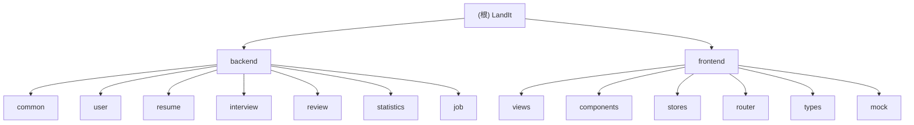

# CLAUDE.md

This file provides guidance to Claude Code (claude.ai/code) when working with code in this repository.

---

# LandIt - 智能求职助手

> **项目名称含义**：LandIt = Land the job（拿下工作）

## 变更记录 (Changelog)

| 时间 | 变更内容 |
|------|---------|
| 2026-02-19 21:53:42 | 初始化AI上下文索引，生成模块结构图，补充完整API清单 |

---

## 项目愿景

LandIt 是一款面向求职者的全流程智能助手工具，旨在帮助用户：
- 管理和优化求职简历
- 进行模拟面试训练
- 对面试表现进行深度复盘分析
- 获取个性化职位推荐
- 跟踪求职进度与能力提升

---

## 架构总览

本项目采用**前后端分离**架构：

```
+------------------+          HTTP/REST          +------------------+
|                  |  <----------------------->  |                  |
|    Frontend      |      /landit/*             |    Backend       |
|    Vue 3 + TS    |                             |   Spring Boot    |
|    Vite 5        |                             |   MyBatis-Plus   |
|                  |                             |   SQLite         |
+------------------+                             +------------------+
       |                                                |
       v                                                v
+------------------+                             +------------------+
|  Pinia Store     |                             |   SQLite DB      |
|  Mock Data       |                             |   landit.db      |
+------------------+                             +------------------+
```

---

## 模块结构图



---

## 模块索引

| 模块 | 路径 | 语言/框架 | 职责 | 文档 |
|------|------|----------|------|------|
| **Backend** | `backend/` | Java 17 + Spring Boot 3.5.11 | 后端API服务 | [详情](./backend/CLAUDE.md) |
| **Frontend** | `frontend/` | TypeScript + Vue 3.4 | 前端SPA应用 | [详情](./frontend/CLAUDE.md) |

### 后端子模块

| 子模块 | 路径 | 职责 |
|--------|------|------|
| common | `backend/.../common/` | 基础实体、枚举、配置、统一响应 |
| user | `backend/.../user/` | 用户信息管理 |
| resume | `backend/.../resume/` | 简历CRUD、AI优化、导出 |
| interview | `backend/.../interview/` | 面试会话、题库、答题流程 |
| review | `backend/.../review/` | 面试复盘、维度分析、改进计划 |
| statistics | `backend/.../statistics/` | 数据统计与可视化 |
| job | `backend/.../job/` | 职位推荐 |

---

## 技术栈

### 后端
- **框架**：Spring Boot 3.5.11 + Java 17
- **ORM**：MyBatis-Plus 3.5.9
- **数据库**：SQLite（文件存储于 `backend/data/landit.db`）
- **工具库**：Lombok、Hutool 5.8.34
- **API 文档**：SpringDoc OpenAPI（访问 `/landit/swagger-ui.html`）

### 前端
- **框架**：Vue 3.4 + TypeScript 5.4
- **构建工具**：Vite 5
- **状态管理**：Pinia 2.1
- **路由**：Vue Router 4.3
- **样式**：SCSS + 全局变量系统
- **工具库**：@vueuse/core

---

## 常用命令

### 后端
```bash
cd backend
mvn spring-boot:run          # 启动开发服务器（端口 8080）
mvn clean package            # 构建生产包
mvn clean compile            # 仅编译
```

### 前端
```bash
cd frontend
npm run dev                  # 启动开发服务器（Vite 默认端口 5173）
npm run build                # 构建生产包（含类型检查）
npm run type-check           # 仅执行 TypeScript 类型检查
npm run preview              # 预览构建结果
```

---

## 项目结构

### 后端模块划分
```
backend/src/main/java/com/landit/
├── common/                  # 公共模块
│   ├── config/              # 配置类（MyBatisPlus、SQLite）
│   ├── entity/              # 基础实体（BaseEntity：id、createdAt、updatedAt、deleted）
│   ├── enums/               # 枚举定义
│   ├── handler/             # MyBatis 元数据处理器
│   └── response/            # 统一响应封装 ApiResponse<T>
├── user/                    # 用户模块
├── resume/                  # 简历模块
├── interview/               # 面试模块
├── review/                  # 复盘模块
├── statistics/              # 统计模块
└── job/                     # 职位推荐模块
```

每个业务模块遵循标准分层：
- `controller/` - API 控制器
- `service/` - 业务逻辑层（接口 + impl 实现类）
- `mapper/` - MyBatis-Plus Mapper 接口
- `entity/` - 数据库实体
- `dto/` - 数据传输对象（Request/Response/VO）

### 前端目录结构
```
frontend/src/
├── views/                   # 页面组件（对应路由）
│   ├── Home.vue             # 首页
│   ├── Resume.vue           # 简历列表
│   ├── ResumeDetail.vue     # 简历详情/编辑
│   ├── Interview.vue        # 面试列表
│   ├── InterviewSession.vue # 面试进行中
│   ├── Review.vue           # 复盘列表
│   ├── ReviewDetail.vue     # 复盘详情
│   └── Profile.vue          # 个人中心
├── components/
│   └── common/              # 公共组件（如 AppNavbar）
├── router/                  # 路由配置
├── stores/                  # Pinia 状态管理
├── types/                   # TypeScript 类型定义
├── mock/                    # Mock 数据
└── assets/styles/           # 全局样式
    ├── variables.scss       # 设计系统变量（颜色、字体、间距等）
    └── global.scss          # 全局样式
```

---

## 架构要点

### API 统一响应格式
```json
{
  "code": 200,
  "message": "success",
  "data": <T>,
  "timestamp": 1708329600000
}
```

### 后端上下文路径
所有 API 请求前缀：`/landit`
- 示例：`http://localhost:8080/landit/user/profile`

### 前端设计系统
- **主题**：深色系（深炭黑背景 + 琥珀金强调色）
- **SCSS 变量**：已在 Vite 中全局注入，组件可直接使用 `$color-accent`、`$spacing-md` 等
- **字体**：Outfit（正文） + Crimson Pro（展示）

### 数据库特性
- 使用 SQLite 文件数据库，无需额外服务
- 主键策略：雪花算法（ASSIGN_ID）
- 逻辑删除字段：`deleted`（0=未删除，1=已删除）
- 自动填充：`createdAt`（插入）、`updatedAt`（插入+更新）

---

## API 清单

### 用户模块 `/user`
| 方法 | 路径 | 描述 |
|------|------|------|
| GET | /profile | 获取当前用户信息 |
| PUT | /profile | 更新用户信息 |
| POST | /avatar | 上传头像 |

### 简历模块 `/resumes`
| 方法 | 路径 | 描述 |
|------|------|------|
| GET | / | 获取简历列表 |
| POST | / | 创建空白简历 |
| POST | /upload | 上传简历文件 |
| GET | /{id} | 获取简历详情 |
| PUT | /{id} | 更新简历 |
| DELETE | /{id} | 删除简历 |
| PUT | /{id}/primary | 设置主简历 |
| GET | /{id}/suggestions | 获取优化建议 |
| POST | /{id}/suggestions/{suggestionId}/apply | 应用优化建议 |
| POST | /{id}/optimize | AI优化简历 |
| GET | /{id}/export | 导出简历PDF |

### 面试模块 `/interviews`
| 方法 | 路径 | 描述 |
|------|------|------|
| POST | /sessions | 开始面试会话 |
| POST | /sessions/{sessionId}/answers | 提交回答 |
| GET | /sessions/{sessionId}/hints | 请求提示 |
| POST | /sessions/{sessionId}/finish | 结束面试 |
| GET | /history | 获取面试历史 |
| GET | /{id} | 获取面试详情 |
| GET | /questions | 获取题库 |

### 复盘模块 `/reviews`
| 方法 | 路径 | 描述 |
|------|------|------|
| GET | / | 获取复盘列表 |
| GET | /{id} | 获取复盘详情 |
| GET | /{id}/export | 导出复盘报告 |

### 统计模块 `/statistics`
| 方法 | 路径 | 描述 |
|------|------|------|
| GET | / | 获取统计数据 |

### 职位模块 `/jobs`
| 方法 | 路径 | 描述 |
|------|------|------|
| GET | /recommendations | 获取推荐职位 |

---

## 测试策略

**当前状态**：项目尚未包含测试代码。

**建议补充**：
- 后端：JUnit 5 + Mockito 单元测试，Spring Boot Test 集成测试
- 前端：Vitest + Vue Test Utils 组件测试

---

## 编码规范

### Java 后端
1. 所有类添加 `@author Azir` 注释
2. 使用 `@RequiredArgsConstructor` + `private final` 进行构造注入
3. Service 接口继承 `IService<T>`
4. 避免在 Controller 中写业务逻辑
5. 简单查询使用 MyBatis-Plus 条件构造器，复杂联查使用 XML

### TypeScript 前端
1. 所有类型定义集中在 `types/index.ts`
2. 使用 Composition API + `<script setup>`
3. 状态管理使用 Pinia Store

---

## AI 使用指引

### 开发建议
1. 修改代码后同步更新 `CLAUDE.md` 文档
2. 新增 API 需在 `openapi.yaml` 中定义 Schema
3. 新增数据库表需更新 `schema.sql`

### 上下文文件
- **API 定义**：`backend/docs/openapi.yaml`
- **数据库结构**：`backend/src/main/resources/schema.sql`
- **前端类型**：`frontend/src/types/index.ts`
- **设计系统**：`frontend/src/assets/styles/variables.scss`

---

## 覆盖率报告

| 指标 | 数值 |
|------|------|
| 估算总文件数 | 95 |
| 已扫描文件数 | 78 |
| 文件覆盖率 | 82.1% |
| 已覆盖模块数 | 9 |
| 总模块数 | 9 |
| 模块覆盖率 | 100% |

### 未覆盖区域
1. **测试代码**：后端和前端均未发现测试文件
2. **Service实现类**：仅读取了 Service 接口
3. **Mapper XML**：项目可能使用纯注解方式

### 建议下一步深挖
- `backend/src/main/java/com/landit/*/service/impl/` - Service 实现类
- `backend/src/test/` - 单元测试（如需补充）
- `frontend/src/__tests__/` - 前端测试（如需补充）

---
*最后更新：2026-02-19 21:53:42*
