# 面试生命周期管理 - 技术实现文档

> 文档版本：1.0
> 创建日期：2026-03-31
> 作者：Azir
> 对应需求：[interview-lifecycle.md](./interview-lifecycle.md)

---

## 一、概述与目标

### 1.1 项目背景

LandIt 现有模拟面试和面试复盘功能，但缺少**真实面试的全流程管理能力**。本技术文档描述如何将现有功能整合为统一的"面试中心"，并新增真实面试生命周期管理能力。

### 1.2 技术目标

| 目标 | 说明 |
|------|------|
| 统一入口 | 将"面试试演"和"面试复盘"合并为"面试中心" |
| 类型区分 | 支持真实面试（Real）和模拟面试（Mock）两种类型 |
| 生命周期管理 | 实现 准备 → 参加 → 结果跟踪 → 复盘 的全流程 |
| 多轮面试 | 支持一次面试包含多轮，每轮独立状态跟踪 |
| AI 辅助 | 集成 4 个 AI 工作流提供智能分析能力 |

### 1.3 整体架构

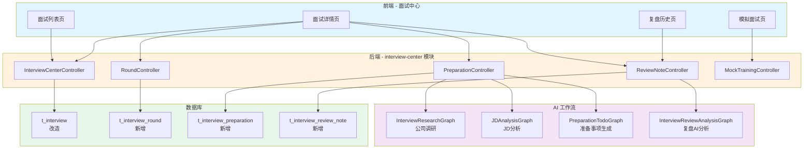

### 1.4 与现有模块的关系

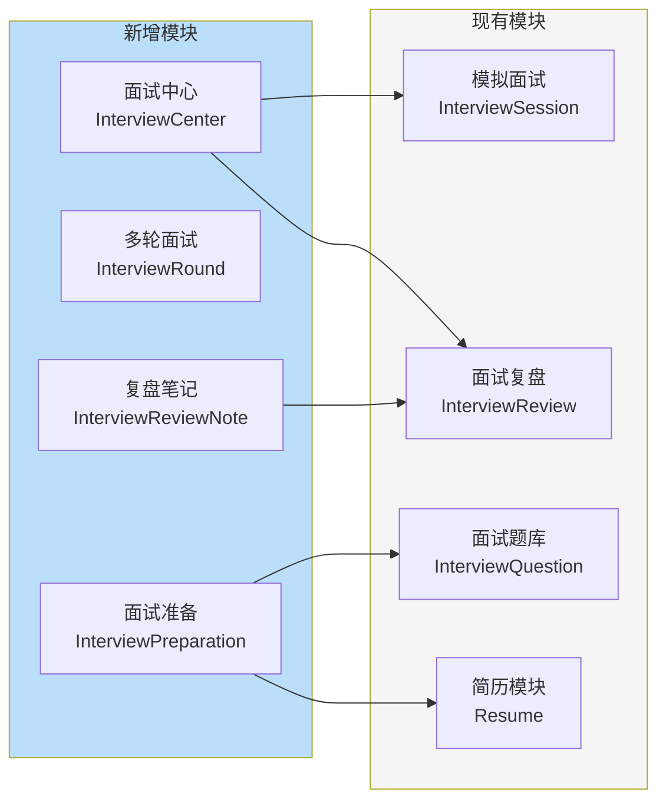

---

## 二、数据库设计

### 2.1 表结构概览

| 表名 | 类型 | 说明 |
|------|------|------|
| t_interview | 改造 | 扩展字段支持真实面试 |
| t_interview_round | 新增 | 面试轮次管理 |
| t_interview_preparation | 新增 | 面试准备清单 |
| t_interview_review_note | 新增 | 面试复盘笔记 |

### 2.2 t_interview 表改造

**现有字段分析**：

| 现有字段 | 类型 | 用途保留 | 说明 |
|---------|------|---------|------|
| status | VARCHAR(20) | ✅ 复用 | 扩展枚举值支持真实面试状态 |
| type | VARCHAR(20) | ✅ 保留 | 面试类型（technical/behavioral），与来源维度不同 |
| score | INTEGER | ✅ 保留 | 模拟面试得分，真实面试可为 null |
| questions | INTEGER | ✅ 保留 | 模拟面试题目数，真实面试可为 null |
| correct_answers | INTEGER | ✅ 保留 | 模拟面试正确数，真实面试可为 null |

**新增字段**：

| 字段 | 类型 | 必填 | 默认值 | 说明 |
|------|------|------|--------|------|
| source | VARCHAR(20) | 否 | 'mock' | 来源：real（真实）/ mock（模拟） |
| jd_content | TEXT | 否 | - | 职位描述内容 |
| overall_result | VARCHAR(20) | 否 | - | 最终结果：passed/failed/pending |
| notes | TEXT | 否 | - | 备注信息 |
| company_research | TEXT | 否 | - | 公司调研结果（JSON） |
| jd_analysis | TEXT | 否 | - | JD分析结果（JSON） |

> ⚠️ **注意**：`status` 字段复用现有字段，通过扩展枚举值支持真实面试状态。现有模拟面试数据（status='in_progress'）不受影响。

**状态流转图**：

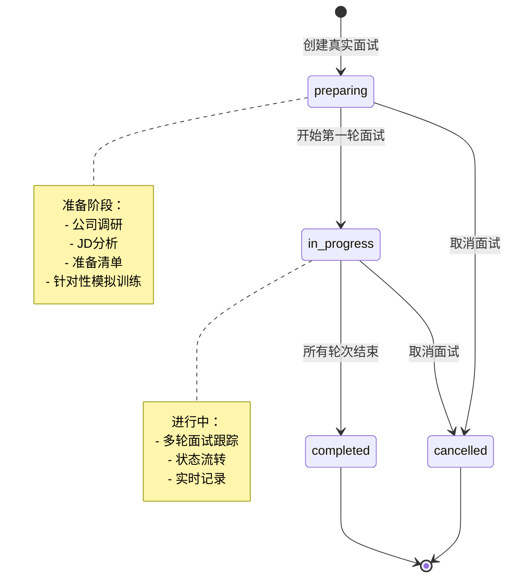

**状态与来源的对应关系**：

| source | 允许的 status | 说明 |
|--------|--------------|------|
| mock | in_progress, completed | 模拟面试只有两种状态 |
| real | preparing, in_progress, completed, cancelled | 真实面试完整状态流转 |

### 2.3 t_interview_round 表（新增）

面试轮次表，管理多轮面试：

| 字段 | 类型 | 必填 | 默认值 | 说明 |
|------|------|------|--------|------|
| id | VARCHAR(64) | 是 | - | 主键（雪花算法） |
| interview_id | VARCHAR(64) | 是 | - | 关联面试ID |
| round_type | VARCHAR(30) | 是 | - | 轮次类型（见枚举） |
| round_name | VARCHAR(50) | 否 | - | 自定义轮次名称 |
| round_order | INTEGER | 是 | - | 轮次顺序 |
| status | VARCHAR(20) | 是 | 'pending' | 轮次状态（见枚举） |
| scheduled_date | DATETIME | 否 | - | 预定日期 |
| actual_date | DATETIME | 否 | - | 实际日期 |
| notes | TEXT | 否 | - | 面试笔记 |
| self_rating | INTEGER | 否 | - | 自我评价（1-5星） |
| result_note | TEXT | 否 | - | 结果说明 |
| created_at | DATETIME | 是 | CURRENT | 创建时间 |
| updated_at | DATETIME | 是 | CURRENT | 更新时间 |
| deleted | TINYINT | 是 | 0 | 逻辑删除标记 |

**轮次状态流转**：

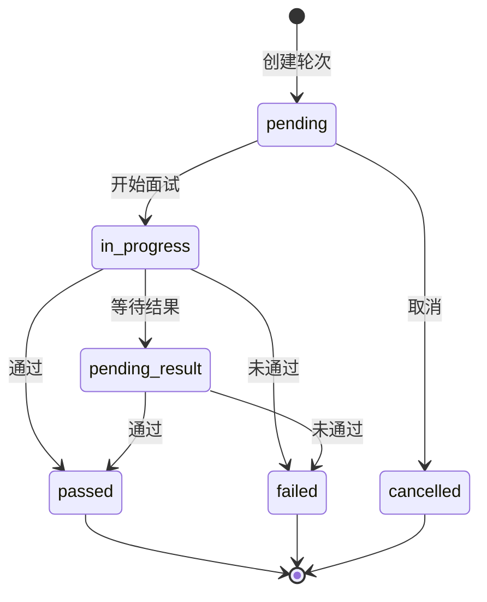

### 2.4 t_interview_preparation 表（新增）

面试准备清单表：

| 字段 | 类型 | 必填 | 默认值 | 说明 |
|------|------|------|--------|------|
| id | VARCHAR(64) | 是 | - | 主键 |
| interview_id | VARCHAR(64) | 是 | - | 关联面试ID |
| item_type | VARCHAR(20) | 是 | - | 类型（见枚举） |
| title | VARCHAR(200) | 是 | - | 标题 |
| content | TEXT | 否 | - | 详细内容 |
| completed | TINYINT | 是 | 0 | 是否完成（0/1） |
| source | VARCHAR(20) | 是 | 'manual' | 来源：ai_generated/manual |
| sort_order | INTEGER | 是 | 0 | 排序 |
| created_at | DATETIME | 是 | CURRENT | 创建时间 |
| updated_at | DATETIME | 是 | CURRENT | 更新时间 |
| deleted | TINYINT | 是 | 0 | 逻辑删除 |

### 2.5 t_interview_review_note 表（新增）

面试复盘笔记表：

| 字段 | 类型 | 必填 | 默认值 | 说明 |
|------|------|------|--------|------|
| id | VARCHAR(64) | 是 | - | 主键 |
| interview_id | VARCHAR(64) | 是 | - | 关联面试ID |
| type | VARCHAR(20) | 是 | - | 类型：manual/ai_analysis |
| overall_feeling | TEXT | 否 | - | 整体感受 |
| high_points | TEXT | 否 | - | 好的方面 |
| weak_points | TEXT | 否 | - | 不足之处 |
| lessons_learned | TEXT | 否 | - | 经验教训 |
| suggestions | TEXT | 否 | - | AI建议（JSON） |
| created_at | DATETIME | 是 | CURRENT | 创建时间 |
| updated_at | DATETIME | 是 | CURRENT | 更新时间 |
| deleted | TINYINT | 是 | 0 | 逻辑删除 |

### 2.6 枚举定义

#### 2.6.1 面试来源（InterviewSource）

```java
public enum InterviewSource {
    REAL("real", "真实面试"),
    MOCK("mock", "模拟面试");
}
```

> 对应数据库字段 `source`（非 `interview_source`，与现有命名风格保持一致）。

#### 2.6.2 面试整体状态（InterviewStatus - 扩展）

> 复用现有 `status` 字段，扩展枚举值以支持真实面试。

```java
public enum InterviewStatus {
    // 模拟面试状态（现有）
    IN_PROGRESS("in_progress", "进行中"),
    COMPLETED("completed", "已完成"),

    // 真实面试扩展状态
    PREPARING("preparing", "准备中"),
    CANCELLED("cancelled", "已取消");

    /**
     * 判断状态是否对给定来源有效
     * @param source 面试来源（real/mock）
     */
    public boolean isValidFor(String source) {
        if ("mock".equals(source)) {
            return this == IN_PROGRESS || this == COMPLETED;
        }
        return true; // real 支持所有状态
    }
}
```

**状态适用范围**：
- 模拟面试：`in_progress` → `completed`（现有逻辑不变）
- 真实面试：`preparing` → `in_progress` → `completed`/`cancelled`

#### 2.6.3 面试结果（InterviewResult）

```java
public enum InterviewResult {
    PASSED("passed", "已通过"),
    FAILED("failed", "未通过"),
    PENDING("pending", "待定");
}
```

#### 2.6.4 轮次类型（RoundType）

```java
public enum RoundType {
    TECHNICAL_1("technical_1", "技术一面"),
    TECHNICAL_2("technical_2", "技术二面"),
    HR("hr", "HR面"),
    DIRECTOR("director", "总监面"),
    CTO("cto", "CTO/VP面"),
    FINAL("final", "终面"),
    CUSTOM("custom", "自定义");
}
```

#### 2.6.5 轮次状态（RoundStatus）

```java
public enum RoundStatus {
    PENDING("pending", "待面试"),
    IN_PROGRESS("in_progress", "进行中"),
    PASSED("passed", "已通过"),
    FAILED("failed", "未通过"),
    PENDING_RESULT("pending_result", "待定"),
    CANCELLED("cancelled", "已取消");
}
```

#### 2.6.6 准备项类型（PreparationItemType）

```java
public enum PreparationItemType {
    COMPANY_RESEARCH("company_research", "公司调研"),
    JD_ANALYSIS("jd_analysis", "JD分析"),
    TODO("todo", "准备事项"),
    MANUAL("manual", "手动记录");
}
```

#### 2.6.7 准备项来源（PreparationSource）

```java
public enum PreparationSource {
    AI_GENERATED("ai_generated", "AI生成"),
    MANUAL("manual", "手动添加");
}
```

#### 2.6.8 复盘笔记类型（ReviewNoteType）

```java
public enum ReviewNoteType {
    MANUAL("manual", "手动记录"),
    AI_ANALYSIS("ai_analysis", "AI分析");
}
```

### 2.7 ER 关系图

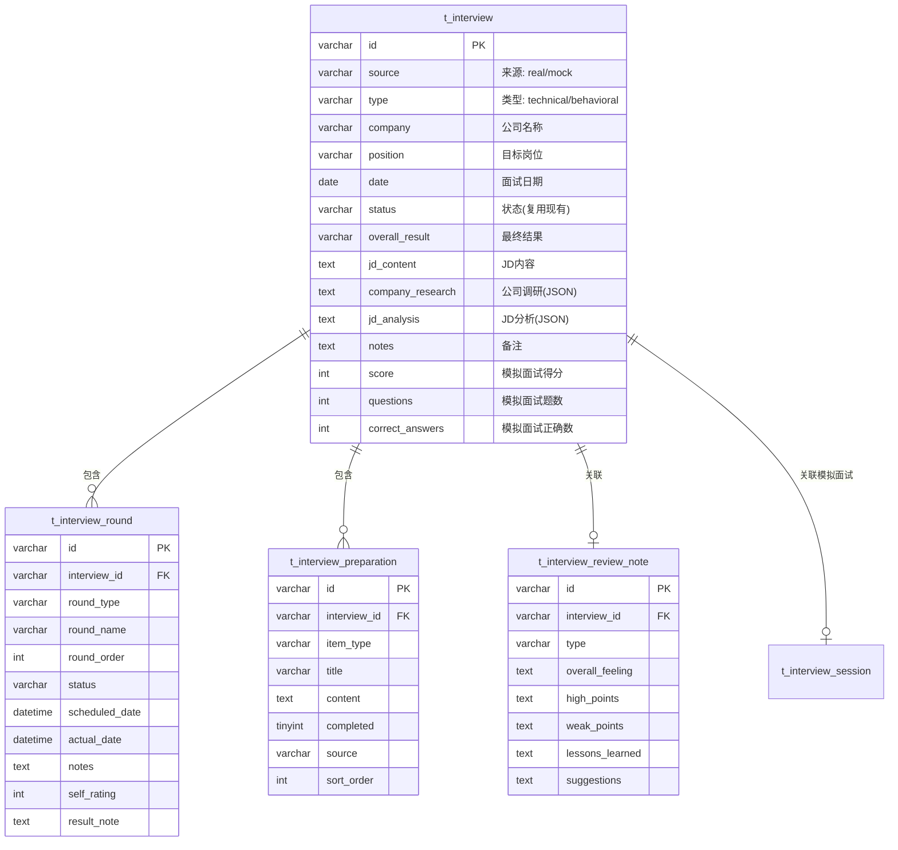

---

## 三、后端实体类改造

### 3.1 现有 Interview 实体类

**文件位置**：`backend/src/main/java/com/landit/interview/entity/Interview.java`

**现有字段**：

```java
@Data
@TableName(value = "t_interview", autoResultMap = true)
public class Interview extends BaseEntity {
    private String userId;          // 用户ID
    private String type;            // 面试类型（technical/behavioral）
    private String position;        // 目标岗位
    private String company;         // 公司名称
    private LocalDate date;         // 面试日期
    private Integer duration;       // 面试时长（分钟）
    private Integer score;          // 面试得分（模拟面试用）
    private String status;          // 面试状态
    private Integer questions;      // 问题总数（模拟面试用）
    private Integer correctAnswers; // 正确回答数（模拟面试用）
}
```

### 3.2 改造方案

**新增字段**：

```java
@Data
@TableName(value = "t_interview", autoResultMap = true)
public class Interview extends BaseEntity {
    // ===== 现有字段保留 =====
    private String userId;
    private String type;            // 面试类型（technical/behavioral），与 source 维度独立
    private String position;
    private String company;
    private LocalDate date;
    private Integer duration;
    private Integer score;          // 模拟面试得分，真实面试为 null
    private String status;          // 复用现有字段，扩展枚举值
    private Integer questions;      // 模拟面试题数，真实面试为 null
    private Integer correctAnswers; // 模拟面试正确数，真实面试为 null

    // ===== 新增字段 =====
    private String source;          // 来源：real/mock
    private String jdContent;       // JD内容
    private String overallResult;   // 最终结果：passed/failed/pending
    private String notes;           // 备注
    private String companyResearch; // 公司调研结果（JSON）
    private String jdAnalysis;      // JD分析结果（JSON）
}
```

### 3.3 字段用途说明

| 字段 | 模拟面试 | 真实面试 | 说明 |
|------|---------|---------|------|
| source | 'mock' | 'real' | 区分面试来源 |
| type | technical/behavioral | technical/behavioral | 面试类型（两个维度独立） |
| status | in_progress/completed | preparing/in_progress/completed/cancelled | 复用现有字段 |
| score | 0-100 | null | 仅模拟面试有分数 |
| questions | 题目数 | null | 仅模拟面试适用 |
| correctAnswers | 正确数 | null | 仅模拟面试适用 |
| duration | 面试时长 | 面试时长 | 两者通用 |
| jdContent | null | JD文本 | 仅真实面试填写 |
| overallResult | null | passed/failed/pending | 仅真实面试有最终结果 |
| companyResearch | null | JSON | 仅真实面试有调研 |
| jdAnalysis | null | JSON | 仅真实面试有分析 |

### 3.4 新增实体类

#### 3.4.1 InterviewRound（面试轮次）

```java
@Data
@TableName("t_interview_round")
public class InterviewRound extends BaseEntity {
    private String interviewId;
    private String roundType;       // 轮次类型（枚举）
    private String roundName;       // 自定义名称
    private Integer roundOrder;     // 顺序
    private String status;          // 轮次状态（枚举）
    private LocalDateTime scheduledDate;
    private LocalDateTime actualDate;
    private String notes;           // 面试笔记
    private Integer selfRating;     // 自我评价（1-5）
    private String resultNote;      // 结果说明
}
```

#### 3.4.2 InterviewPreparation（准备事项）

```java
@Data
@TableName("t_interview_preparation")
public class InterviewPreparation extends BaseEntity {
    private String interviewId;
    private String itemType;        // 类型（枚举）
    private String title;
    private String content;
    private Boolean completed;
    private String source;          // 来源：ai_generated/manual
    private Integer sortOrder;
}
```

#### 3.4.3 InterviewReviewNote（复盘笔记）

```java
@Data
@TableName("t_interview_review_note")
public class InterviewReviewNote extends BaseEntity {
    private String interviewId;
    private String type;            // 类型：manual/ai_analysis
    private String overallFeeling;
    private String highPoints;
    private String weakPoints;
    private String lessonsLearned;
    private String suggestions;     // JSON 格式
}
```

### 3.5 DTO 设计建议

**查询详情时使用独立 VO**，避免暴露实体类：

```java
// 面试详情 VO（包含关联数据）
@Data
public class InterviewDetailVO {
    private String id;
    private String source;
    private String companyName;
    private String position;
    // ... 基础字段

    // 关联数据
    private List<RoundVO> rounds;
    private List<PreparationVO> preparations;
    private ReviewNoteVO reviewNote;

    // JSON 解析后的结构化数据
    private CompanyResearchResult companyResearchData;
    private JDAnalysisResult jdAnalysisData;
}
```

> 💡 **设计建议**：`companyResearch` 和 `jdAnalysis` 字段在实体中存储为 JSON 字符串，在 VO 中解析为结构化对象返回给前端。

---

## 四、后端 API 设计

### 3.1 API 总览

| 分组 | 前缀 | Controller | API 数量 |
|------|------|------------|----------|
| 面试管理 | `/interview-center` | InterviewCenterController | 6 |
| 轮次管理 | `/interview-center/{id}/rounds` | InterviewRoundController | 5 |
| 准备管理 | `/interview-center/{id}/prepare` | InterviewPreparationController | 8 |
| 复盘管理 | `/interview-center/{id}/review` | InterviewReviewNoteController | 3 |
| 针对性训练 | `/interview-center/{id}/mock` | MockTrainingController | 1 |

### 3.2 面试管理 API

#### 3.2.1 创建真实面试

```
POST /interview-center
```

**请求 Body**：

| 字段 | 类型 | 必填 | 说明 |
|------|------|------|------|
| companyName | String | 是 | 公司名称 |
| position | String | 是 | 目标岗位 |
| interviewDate | Date | 是 | 面试日期 |
| jdContent | String | 否 | JD内容 |
| rounds | RoundCreateDTO[] | 否 | 预设轮次列表 |
| notes | String | 否 | 备注 |

**RoundCreateDTO**：

| 字段 | 类型 | 必填 | 说明 |
|------|------|------|------|
| roundType | String | 是 | 轮次类型 |
| roundName | String | 条件 | 自定义名称（roundType=CUSTOM时必填） |
| scheduledDate | Date | 否 | 预定日期 |

**响应**：`InterviewDetailVO`

---

#### 3.2.2 获取面试列表

```
GET /interview-center
```

**请求参数**：

| 参数 | 类型 | 必填 | 说明 |
|------|------|------|------|
| type | String | 否 | 筛选类型：real/mock/all（默认all） |
| status | String | 否 | 状态筛选 |
| page | Integer | 否 | 页码（默认1） |
| size | Integer | 否 | 每页数量（默认20） |

**响应**：`PageResult<InterviewListItemVO>`

**InterviewListItemVO**：

| 字段 | 类型 | 说明 |
|------|------|------|
| id | String | 面试ID |
| source | String | 来源：real/mock |
| companyName | String | 公司名称 |
| position | String | 岗位 |
| interviewDate | Date | 面试日期 |
| status | String | 状态 |
| overallResult | String | 最终结果 |
| roundCount | Integer | 轮次总数 |
| completedRounds | Integer | 已完成轮次 |

---

#### 3.2.3 获取面试详情

```
GET /interview-center/{id}
```

**响应**：`InterviewDetailVO`

| 字段 | 类型 | 说明 |
|------|------|------|
| id | String | 面试ID |
| source | String | 来源 |
| companyName | String | 公司 |
| position | String | 岗位 |
| interviewDate | Date | 面试日期 |
| jdContent | String | JD内容 |
| status | String | 状态 |
| overallResult | String | 最终结果 |
| notes | String | 备注 |
| companyResearch | Object | 公司调研结果 |
| jdAnalysis | Object | JD分析结果 |
| rounds | List<RoundVO> | 轮次列表 |
| preparations | List<PreparationVO> | 准备清单 |
| reviewNote | ReviewNoteVO | 复盘笔记 |

---

#### 3.2.4 更新面试基本信息

```
PUT /interview-center/{id}
```

**请求 Body**：

| 字段 | 类型 | 必填 | 说明 |
|------|------|------|------|
| companyName | String | 否 | 公司名称 |
| position | String | 否 | 目标岗位 |
| interviewDate | Date | 否 | 面试日期 |
| jdContent | String | 否 | JD内容 |
| notes | String | 否 | 备注 |

**响应**：`InterviewDetailVO`

---

#### 3.2.5 更新面试整体状态

```
PATCH /interview-center/{id}/status
```

**请求 Body**：

| 字段 | 类型 | 必填 | 说明 |
|------|------|------|------|
| status | String | 是 | 目标状态 |
| overallResult | String | 否 | 最终结果（status=completed时） |

**响应**：`InterviewDetailVO`

---

#### 3.2.6 删除面试

```
DELETE /interview-center/{id}
```

**响应**：`void`（HTTP 204）

---

### 3.3 轮次管理 API

#### 3.3.1 新增面试轮次

```
POST /interview-center/{id}/rounds
```

**请求 Body**：

| 字段 | 类型 | 必填 | 说明 |
|------|------|------|------|
| roundType | String | 是 | 轮次类型 |
| roundName | String | 条件 | 自定义名称 |
| scheduledDate | Date | 否 | 预定日期 |

**响应**：`RoundVO`

---

#### 3.3.2 更新轮次信息

```
PUT /interview-center/{id}/rounds/{roundId}
```

**请求 Body**：

| 字段 | 类型 | 必填 | 说明 |
|------|------|------|------|
| roundType | String | 否 | 轮次类型 |
| roundName | String | 否 | 自定义名称 |
| scheduledDate | Date | 否 | 预定日期 |
| actualDate | Date | 否 | 实际日期 |
| notes | String | 否 | 面试笔记 |
| selfRating | Integer | 否 | 自我评价（1-5） |
| resultNote | String | 否 | 结果说明 |

**响应**：`RoundVO`

---

#### 3.3.3 更新轮次状态

```
PATCH /interview-center/{id}/rounds/{roundId}/status
```

**请求 Body**：

| 字段 | 类型 | 必填 | 说明 |
|------|------|------|------|
| status | String | 是 | 目标状态 |

**状态流转规则**：

```
                    ┌─────────────────────────────────────────┐
                    │                                         │
                    ▼                                         │
    ┌──────────┐  开始面试   ┌─────────────┐  面试结束   ┌────────────────┐
    │ pending  │ ─────────▶ │ in_progress │ ─────────▶ │ pending_result │
    └──────────┘            └─────────────┘            └────────────────┘
         │                        │                           │
         │ 取消                    │ 通过/失败                  │ 通过/失败
         ▼                        ▼                           ▼
    ┌──────────┐            ┌──────────┐              ┌──────────┐
    │cancelled │            │  passed  │◀─────────────│  passed  │
    └──────────┘            │  failed  │◀─────────────│  failed  │
    [终态]                  └──────────┘              └──────────┘
                            [终态]                    [终态]
```

| 当前状态 | 可流转目标 | 说明 |
|---------|-----------|------|
| pending | in_progress, cancelled | 待面试可开始或取消 |
| in_progress | passed, failed, pending_result | 进行中可结束或等待结果 |
| pending_result | passed, failed | 等待结果可确认通过或失败 |
| passed | - | **终态，不可变更** |
| failed | - | **终态，不可变更** |
| cancelled | - | **终态，不可变更** |

> ⚠️ **终态说明**：`passed`、`failed`、`cancelled` 为终态，一旦进入不可逆转。如需修改，只能删除轮次重新创建。

**响应**：`RoundVO`

---

#### 3.3.4 删除轮次

```
DELETE /interview-center/{id}/rounds/{roundId}
```

**响应**：`void`（HTTP 204）

---

#### 3.3.5 调整轮次顺序

```
PUT /interview-center/{id}/rounds/reorder
```

**请求 Body**：

| 字段 | 类型 | 必填 | 说明 |
|------|------|------|------|
| roundIds | String[] | 是 | 按新顺序排列的轮次ID列表 |

**响应**：`List<RoundVO>`

---

### 3.4 准备管理 API

#### 3.4.1 触发 AI 公司调研

```
POST /interview-center/{id}/prepare/research
```

**请求 Body**：

| 字段 | 类型 | 必填 | 说明 |
|------|------|------|------|
| companyName | String | 是 | 公司名称（可覆盖） |
| jdContent | String | 否 | JD内容（可覆盖） |

**响应**：SSE 流式返回

**事件类型**：
- `status` - 状态更新
- `chunk` - 内容片段
- `complete` - 完成（返回 CompanyResearchVO）

---

#### 3.4.2 触发 AI JD 分析

```
POST /interview-center/{id}/prepare/jd-analysis
```

**请求 Body**：

| 字段 | 类型 | 必填 | 说明 |
|------|------|------|------|
| jdContent | String | 是 | JD内容（可覆盖） |
| resumeId | String | 否 | 简历ID（用于匹配度分析） |

**响应**：SSE 流式返回

**完成事件返回 JDAnalysisVO**：

| 字段 | 类型 | 说明 |
|------|------|------|
| coreSkills | String[] | 核心技能要求 |
| bonusSkills | String[] | 加分技能 |
| keywords | String[] | 关键词 |
| level | String | 岗位级别：junior/mid/senior |
| matchScore | Integer | 简历匹配度（0-100） |
| suggestions | String[] | 准备建议 |

---

#### 3.4.3 获取准备清单

```
GET /interview-center/{id}/prepare/todos
```

**请求参数**：

| 参数 | 类型 | 必填 | 说明 |
|------|------|------|------|
| itemType | String | 否 | 类型筛选 |
| completed | Boolean | 否 | 完成状态筛选 |

**响应**：`List<PreparationVO>`

---

#### 3.4.4 AI 生成准备事项

```
POST /interview-center/{id}/prepare/todos/generate
```

**请求 Body**：

| 字段 | 类型 | 必填 | 说明 |
|------|------|------|------|
| basedOn | String | 是 | 生成依据：jd_analysis / company_research / both |

**响应**：SSE 流式返回，完成后自动添加到准备清单

---

#### 3.4.5 手动添加准备事项

```
POST /interview-center/{id}/prepare/todos
```

**请求 Body**：

| 字段 | 类型 | 必填 | 说明 |
|------|------|------|------|
| title | String | 是 | 标题 |
| content | String | 否 | 详细内容 |

**响应**：`PreparationVO`

---

#### 3.4.6 更新准备事项

```
PUT /interview-center/{id}/prepare/todos/{todoId}
```

**请求 Body**：

| 字段 | 类型 | 必填 | 说明 |
|------|------|------|------|
| title | String | 否 | 标题 |
| content | String | 否 | 详细内容 |
| completed | Boolean | 否 | 完成状态 |
| sortOrder | Integer | 否 | 排序 |

**响应**：`PreparationVO`

---

#### 3.4.7 切换完成状态

```
PATCH /interview-center/{id}/prepare/todos/{todoId}/toggle
```

**响应**：`PreparationVO`

---

#### 3.4.8 删除准备事项

```
DELETE /interview-center/{id}/prepare/todos/{todoId}
```

**响应**：`void`（HTTP 204）

---

### 3.5 复盘管理 API

#### 3.5.1 获取复盘笔记

```
GET /interview-center/{id}/review
```

**响应**：`ReviewNoteDetailVO`

| 字段 | 类型 | 说明 |
|------|------|------|
| manual | ReviewNoteVO | 手动复盘 |
| aiAnalysis | ReviewNoteVO | AI分析结果 |

---

#### 3.5.2 保存手动复盘

```
POST /interview-center/{id}/review
```

**请求 Body**：

| 字段 | 类型 | 必填 | 说明 |
|------|------|------|------|
| overallFeeling | String | 否 | 整体感受 |
| highPoints | String | 否 | 好的方面 |
| weakPoints | String | 否 | 不足之处 |
| lessonsLearned | String | 否 | 经验教训 |

**响应**：`ReviewNoteVO`

---

#### 3.5.3 触发 AI 复盘分析

```
POST /interview-center/{id}/review/ai-analysis
```

**响应**：SSE 流式返回

**完成事件返回 ReviewNoteVO**：

| 字段 | 类型 | 说明 |
|------|------|------|
| overallFeeling | String | AI整体评价 |
| highPoints | String | 表现亮点 |
| weakPoints | String | 需改进点 |
| lessonsLearned | String | 关键经验 |
| suggestions | Suggestion[] | 改进建议列表 |

**Suggestion 结构**：

| 字段 | 类型 | 说明 |
|------|------|------|
| category | String | 分类：skill/behavior/preparation |
| content | String | 建议内容 |
| priority | String | 优先级：high/medium/low |

---

### 3.6 针对性训练 API

#### 3.6.1 基于JD创建模拟面试

```
POST /interview-center/{id}/mock-session
```

**请求 Body**：

| 字段 | 类型 | 必填 | 说明 |
|------|------|------|------|
| questionCount | Integer | 否 | 题目数量（默认5） |
| difficulty | String | 否 | 难度：easy/medium/hard |
| voiceMode | String | 否 | 语音模式：text/half/full |

**响应**：`StartSessionResponse`

| 字段 | 类型 | 说明 |
|------|------|------|
| sessionId | String | 模拟面试会话ID |
| redirectUrl | String | 跳转地址 |

**实现逻辑**：

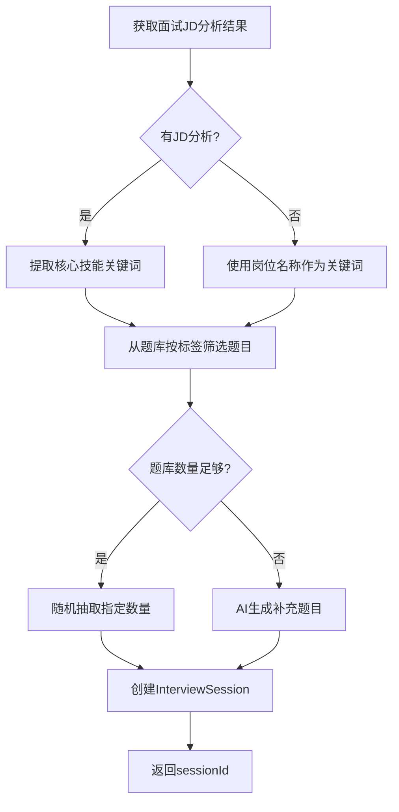

> 💡 **实现细节**：
> 1. **题库筛选**：根据 JD 分析的 `coreSkills` 和 `keywords` 从 `t_interview_question` 按标签匹配
> 2. **AI 补充**：题库数量不足时，调用 AI 实时生成补充题目（不持久化到题库）
> 3. **关联记录**：在 `t_interview` 新增 `mock_session_id` 字段记录关联（可选，后续扩展）
> 4. **复用现有流程**：创建会话后，走现有的模拟面试流程（答题、评分、复盘）

---

### 3.7 通用响应结构

**成功响应**：

```json
{
  "code": 200,
  "message": "success",
  "data": <T>,
  "timestamp": 1708329600000
}
```

**错误响应**：

```json
{
  "code": 400,
  "message": "错误描述",
  "data": null,
  "timestamp": 1708329600000
}
```

**HTTP 状态码规范**：

| 状态码 | 说明 |
|--------|------|
| 200 | 成功 |
| 201 | 创建成功 |
| 204 | 删除成功（无内容） |
| 400 | 请求参数错误 |
| 404 | 资源不存在 |
| 409 | 状态冲突（如状态流转不合法） |
| 500 | 服务器内部错误 |

---

## 四、AI 工作流设计

### 4.1 工作流概览

| 工作流 | 类名 | 触发场景 | 输出类型 |
|--------|------|---------|---------|
| 公司调研 | InterviewResearchGraph | 创建面试/手动触发 | CompanyResearchResult |
| JD分析 | JDAnalysisGraph | 创建面试/手动触发 | JDAnalysisResult |
| 准备事项生成 | PreparationTodoGraph | JD分析后/手动触发 | List<PreparationItem> |
| 复盘AI分析 | InterviewReviewAnalysisGraph | 面试结束后 | ReviewAnalysisResult |

### 4.2 公司调研工作流（InterviewResearchGraph）

#### 4.2.1 流程图

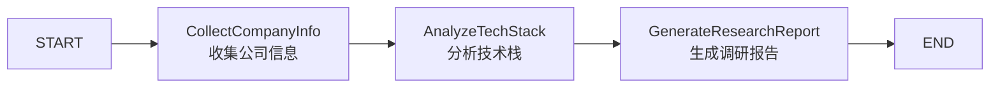

#### 4.2.2 节点职责

| 节点 | 职责 | 输入 | 输出 |
|------|------|------|------|
| CollectCompanyInfo | 基于 AI 推测公司基本信息 | companyName + jdContent | 公司基本信息（行业、规模、业务） |
| AnalyzeTechStack | 结合 JD 推测技术栈 | 公司信息 + jdContent | 技术栈列表、技术文化 |
| GenerateResearchReport | 汇总生成结构化报告 | 上述所有 | 完整调研报告 JSON |

> ⚠️ **数据来源说明**：
> - 公司调研**不依赖外部 API**，完全基于 AI 大模型推测
> - 准确性取决于公司名称的完整度和 JD 内容
> - 建议提示用户"AI 推测结果仅供参考，请根据实际情况修正"

#### 4.2.3 状态键定义

| 键名 | 类型 | 说明 |
|------|------|------|
| company_name | String | 公司名称 |
| jd_content | String | JD内容 |
| company_basic_info | Object | 公司基本信息 |
| tech_stack | List<String> | 技术栈 |
| research_report | Object | 最终报告 |
| messages | List<String> | 处理日志 |

#### 4.2.4 输出结构（CompanyResearchResult）

```typescript
interface CompanyResearchResult {
  companyName: string           // 公司名称
  industry: string              // 行业
  scale: string                 // 规模
  business: string              // 主营业务
  culture: string               // 企业文化
  techStack: string[]           // 技术栈
  recentNews: string[]          // 近期动态
  interviewTips: string[]       // 面试建议
}
```

---

### 4.3 JD分析工作流（JDAnalysisGraph）

#### 4.3.1 流程图

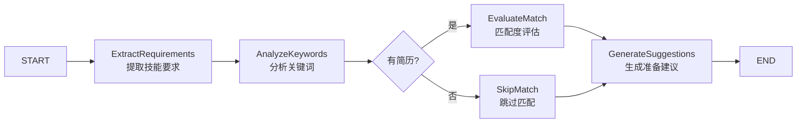

#### 4.3.2 节点职责

| 节点 | 职责 | 输入 | 输出 |
|------|------|------|------|
| ExtractRequirements | 提取核心技能和加分技能 | jdContent | coreSkills, bonusSkills |
| AnalyzeKeywords | 提取关键词、判断岗位级别 | jdContent | keywords, level |
| EvaluateMatch | 对比简历计算匹配度 | skills + resume | matchScore, gaps |
| SkipMatch | 跳过匹配（占位节点） | - | matchScore = null |
| GenerateSuggestions | 生成针对性准备建议 | 上述所有 | suggestions |

#### 4.3.3 状态键定义

| 键名 | 类型 | 说明 |
|------|------|------|
| jd_content | String | JD内容 |
| resume_id | String | 简历ID（可选） |
| resume_content | String | 简历内容（可选） |
| core_skills | List<String> | 核心技能 |
| bonus_skills | List<String> | 加分技能 |
| keywords | List<String> | 关键词 |
| level | String | 岗位级别 |
| match_score | Integer | 匹配度（0-100） |
| skill_gaps | List<String> | 技能差距 |
| suggestions | List<String> | 准备建议 |

#### 4.3.4 输出结构（JDAnalysisResult）

```typescript
interface JDAnalysisResult {
  coreSkills: string[]          // 核心技能要求
  bonusSkills: string[]         // 加分技能
  keywords: string[]            // 关键词
  level: 'junior' | 'mid' | 'senior'  // 岗位级别
  matchScore: number | null     // 匹配度（无简历时为null）
  skillGaps: string[]           // 技能差距
  suggestions: string[]         // 技能准备方向（抽象层面）
}
```

> 💡 **与准备事项的区别**：
> - `suggestions`：**技能准备方向**，如"复习 Spring Boot 原理"、"了解分布式系统"
> - 准备事项工作流的 `todos`：**具体可执行事项**，如"阅读 Spring Boot 自动配置原理文档"、"完成 1 道分布式锁练习题"

---

### 4.4 准备事项生成工作流（PreparationTodoGraph）

#### 4.4.1 流程图

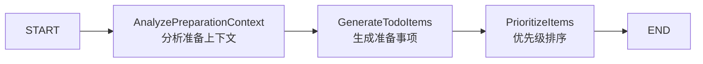

#### 4.4.2 节点职责

| 节点 | 职责 | 输入 | 输出 |
|------|------|------|------|
| AnalyzePreparationContext | 综合分析JD和公司调研结果 | jdAnalysis + companyResearch | 准备重点 |
| GenerateTodoItems | 生成具体准备事项 | 准备重点 | 待排序事项列表 |
| PrioritizeItems | 按重要性和紧急度排序 | 事项列表 | 排序后事项列表 |

#### 4.4.3 状态键定义

| 键名 | 类型 | 说明 |
|------|------|------|
| jd_analysis | Object | JD分析结果 |
| company_research | Object | 公司调研结果 |
| preparation_focus | List<String> | 准备重点 |
| raw_todos | List<Object> | 原始事项列表 |
| prioritized_todos | List<Object> | 排序后事项 |

#### 4.4.4 输出结构

```typescript
interface PreparationTodo {
  title: string                 // 标题
  content: string               // 详细内容
  category: 'skill' | 'company' | 'behavior' | 'project'  // 分类
  priority: 'high' | 'medium' | 'low'  // 优先级
  estimatedTime: string         // 预计耗时
}
```

---

### 4.5 复盘AI分析工作流（InterviewReviewAnalysisGraph）

#### 4.5.1 流程图

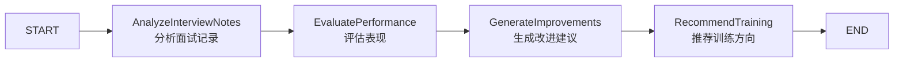

#### 4.5.2 节点职责

| 节点 | 职责 | 输入 | 输出 |
|------|------|------|------|
| AnalyzeInterviewNotes | 分析面试笔记和轮次记录 | notes + roundRecords | 关键点提取 |
| EvaluatePerformance | 综合评估面试表现 | 关键点 + JD | 表现评价 |
| GenerateImprovements | 生成具体改进建议 | 表现评价 | 改进建议列表 |
| RecommendTraining | 推荐后续训练方向 | 改进建议 | 训练推荐 |

#### 4.5.3 状态键定义

| 键名 | 类型 | 说明 |
|------|------|------|
| interview_id | String | 面试ID |
| interview_notes | String | 面试笔记 |
| round_records | List<Object> | 轮次记录 |
| jd_analysis | Object | JD分析结果 |
| key_points | List<String> | 关键点 |
| performance_evaluation | Object | 表现评价 |
| improvements | List<Object> | 改进建议 |
| training_recommendations | List<Object> | 训练推荐 |

#### 4.5.4 输出结构（ReviewAnalysisResult）

```typescript
interface ReviewAnalysisResult {
  overallFeeling: string        // 整体评价
  highPoints: string[]          // 表现亮点
  weakPoints: string[]          // 不足之处
  lessonsLearned: string[]      // 经验教训
  suggestions: Suggestion[]     // 改进建议
  trainingRecommendations: TrainingRec[]  // 训练推荐
}

interface Suggestion {
  category: 'skill' | 'behavior' | 'preparation'
  content: string
  priority: 'high' | 'medium' | 'low'
  actionable: boolean           // 是否可执行
}

interface TrainingRec {
  type: 'mock_interview' | 'skill_learning' | 'project_practice'
  title: string
  description: string
  relatedSkills: string[]
}
```

---

### 4.6 工作流实现参考

#### 4.6.1 目录结构

```
backend/src/main/java/com/landit/interview/
└── graph/
    ├── BaseInterviewGraphConstants.java     # 公共常量
    ├── research/
    │   ├── InterviewResearchGraphConfig.java
    │   ├── InterviewResearchGraphConstants.java
    │   ├── InterviewResearchGraphService.java
    │   └── nodes/
    │       ├── CollectCompanyInfoNode.java
    │       ├── AnalyzeTechStackNode.java
    │       └── GenerateResearchReportNode.java
    ├── jd/
    │   ├── JDAnalysisGraphConfig.java
    │   ├── JDAnalysisGraphConstants.java
    │   ├── JDAnalysisGraphService.java
    │   └── nodes/
    │       ├── ExtractRequirementsNode.java
    │       ├── AnalyzeKeywordsNode.java
    │       ├── EvaluateMatchNode.java
    │       └── GenerateSuggestionsNode.java
    ├── preparation/
    │   ├── PreparationTodoGraphConfig.java
    │   ├── PreparationTodoGraphConstants.java
    │   ├── PreparationTodoGraphService.java
    │   └── nodes/
    │       ├── AnalyzePreparationContextNode.java
    │       ├── GenerateTodoItemsNode.java
    │       └── PrioritizeItemsNode.java
    └── review/
        ├── InterviewReviewAnalysisGraphConfig.java
        ├── InterviewReviewAnalysisGraphConstants.java
        ├── InterviewReviewAnalysisGraphService.java
        └── nodes/
            ├── AnalyzeInterviewNotesNode.java
            ├── EvaluatePerformanceNode.java
            ├── GenerateImprovementsNode.java
            └── RecommendTrainingNode.java
```

#### 4.6.2 SSE 事件格式

所有工作流通过 SSE 流式返回结果：

```
event: status
data: {"step": "CollectCompanyInfo", "status": "running"}

event: chunk
data: {"content": "正在分析公司信息..."}

event: status
data: {"step": "CollectCompanyInfo", "status": "completed"}

event: status
data: {"step": "AnalyzeTechStack", "status": "running"}

event: chunk
data: {"content": "识别到技术栈：Spring Boot, Redis, MySQL..."}

event: complete
data: {"result": {...完整结果...}}
```

---

## 五、前端架构改造

### 5.1 路由重构

#### 5.1.1 新旧路由对比

| 旧路由 | 新路由 | 说明 |
|--------|--------|------|
| /interview | /interview-center/mock | 模拟面试入口 |
| /interview/:id | /interview-center/mock/:sessionId | 模拟面试进行中 |
| /review | /interview-center/reviews | 复盘历史 |
| /review/:id | /interview-center/reviews/:id | 复盘详情 |
| - | /interview-center | **新增** 面试列表 |
| - | /interview-center/:id | **新增** 面试详情 |

#### 5.1.2 完整路由表

```typescript
const routes = [
  {
    path: '/interview-center',
    component: () => import('@/views/interview-center/Layout.vue'),
    children: [
      {
        path: '',
        name: 'InterviewList',
        component: () => import('@/views/interview-center/InterviewList.vue'),
        meta: { title: '面试中心' }
      },
      {
        path: ':id',
        name: 'InterviewDetail',
        component: () => import('@/views/interview-center/InterviewDetail.vue'),
        meta: { title: '面试详情' }
      },
      {
        path: 'mock',
        name: 'MockInterviewEntry',
        component: () => import('@/views/interview-center/MockEntry.vue'),
        meta: { title: '模拟面试' }
      },
      {
        path: 'mock/:sessionId',
        name: 'MockInterviewSession',
        component: () => import('@/views/interview-center/MockSession.vue'),
        meta: { title: '面试进行中' }
      },
      {
        path: 'reviews',
        name: 'ReviewList',
        component: () => import('@/views/interview-center/ReviewList.vue'),
        meta: { title: '复盘历史' }
      },
      {
        path: 'reviews/:id',
        name: 'ReviewDetail',
        component: () => import('@/views/interview-center/ReviewDetail.vue'),
        meta: { title: '复盘详情' }
      }
    ]
  }
]
```

### 5.2 页面结构

#### 5.2.1 页面清单

| 页面 | 文件 | 职责 |
|------|------|------|
| 面试列表 | InterviewList.vue | 展示所有面试（真实+模拟），支持筛选 |
| 面试详情 | InterviewDetail.vue | 单个面试的完整信息展示和操作 |
| 模拟面试入口 | MockEntry.vue | 选择面试类型、设置参数 |
| 模拟面试进行 | MockSession.vue | 面试对话界面（复用现有） |
| 复盘列表 | ReviewList.vue | 复盘历史列表 |
| 复盘详情 | ReviewDetail.vue | 复盘详情展示 |

#### 5.2.2 面试详情页结构

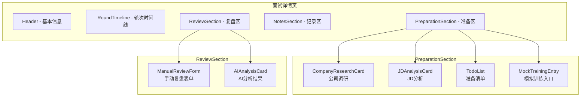

### 5.3 组件设计

#### 5.3.1 新增组件清单

| 组件 | 路径 | 职责 |
|------|------|------|
| InterviewCard | components/interview-center/ | 面试卡片（列表项） |
| RoundTimeline | components/interview-center/ | 轮次时间线 |
| RoundCard | components/interview-center/ | 单轮面试卡片 |
| CompanyResearchCard | components/interview-center/preparation/ | 公司调研结果展示 |
| JDAnalysisCard | components/interview-center/preparation/ | JD分析结果展示 |
| TodoList | components/interview-center/preparation/ | 准备清单 |
| TodoItem | components/interview-center/preparation/ | 准备事项项 |
| ManualReviewForm | components/interview-center/review/ | 手动复盘表单 |
| AIAnalysisCard | components/interview-center/review/ | AI分析结果展示 |
| CreateInterviewDialog | components/interview-center/ | 创建面试弹窗 |
| AddRoundDialog | components/interview-center/ | 添加轮次弹窗 |

#### 5.3.2 组件目录结构

```
frontend/src/
├── views/
│   └── interview-center/
│       ├── Layout.vue
│       ├── InterviewList.vue
│       ├── InterviewDetail.vue
│       ├── MockEntry.vue
│       ├── MockSession.vue
│       ├── ReviewList.vue
│       └── ReviewDetail.vue
│
└── components/
    └── interview-center/
        ├── InterviewCard.vue
        ├── RoundTimeline.vue
        ├── RoundCard.vue
        ├── CreateInterviewDialog.vue
        ├── AddRoundDialog.vue
        ├── preparation/
        │   ├── CompanyResearchCard.vue
        │   ├── JDAnalysisCard.vue
        │   ├── TodoList.vue
        │   └── TodoItem.vue
        └── review/
            ├── ManualReviewForm.vue
            └── AIAnalysisCard.vue
```

### 5.4 状态管理

#### 5.4.1 新增 Pinia Store

| Store | 文件 | 职责 |
|-------|------|------|
| useInterviewCenter | stores/interview-center.ts | 面试列表、当前面试详情 |
| useInterviewPreparation | stores/interview-preparation.ts | 准备相关状态 |
| useInterviewReview | stores/interview-review.ts | 复盘相关状态 |

#### 5.4.2 useInterviewCenter Store

```typescript
interface InterviewCenterState {
  // 列表
  interviews: InterviewListItem[]
  listLoading: boolean
  listFilter: {
    type: 'all' | 'real' | 'mock'
    status?: string
  }

  // 详情
  currentInterview: InterviewDetail | null
  detailLoading: boolean

  // 操作
  isCreating: boolean
  isUpdating: boolean
}
```

### 5.5 API 模块

#### 5.5.1 API 文件结构

```
frontend/src/api/
├── interview-center.ts      # 面试管理 API
├── interview-round.ts       # 轮次管理 API
├── interview-preparation.ts # 准备管理 API
└── interview-review.ts      # 复盘管理 API
```

### 5.6 类型定义

#### 5.6.1 类型文件结构

```
frontend/src/types/
├── interview-center.ts      # 面试中心核心类型
├── interview-round.ts       # 轮次相关类型
├── interview-preparation.ts # 准备相关类型
└── interview-review.ts      # 复盘相关类型
```

---

## 六、整合方案与实施计划

### 6.1 与现有模块整合

#### 6.1.1 整合关系图

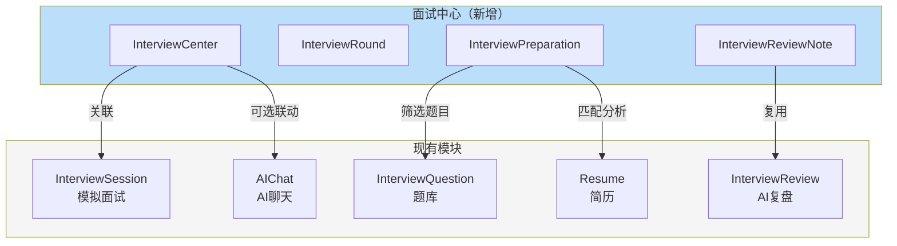

#### 6.1.2 模拟面试整合

| 整合点 | 说明 |
|--------|------|
| 入口整合 | 模拟面试入口迁移到面试中心 |
| 针对性训练 | 从真实面试准备区可发起基于JD的模拟面试 |
| 结果关联 | 模拟面试结果可关联到真实面试的准备记录 |
| 数据共享 | 复用现有 InterviewSession、Conversation 表 |

**数据关联**：
- t_interview 新增 `mock_session_id` 字段（可选）
- 当从真实面试发起针对性训练时，记录关联关系

#### 6.1.3 面试复盘整合

| 整合点 | 说明 |
|--------|------|
| 双轨并行 | 模拟面试继续自动生成 AI 复盘（t_interview_review） |
| 手动复盘 | 真实面试支持手动复盘（t_interview_review_note） |
| AI 辅助 | 真实面试可触发 AI 分析（新增工作流） |
| 统一入口 | 复盘历史页同时展示两种复盘 |

#### 6.1.4 简历模块联动

| 联动点 | 说明 |
|--------|------|
| JD 匹配分析 | JD 分析时可传入简历 ID，计算匹配度 |
| 技能差距 | 对比简历技能与 JD 要求，生成差距列表 |
| 简历引用 | 准备事项可引用简历中的项目经历 |

#### 6.1.5 AI Chat 联动（可选）

| 联动点 | 说明 |
|--------|------|
| 面试咨询 | 用户可通过 AI Chat 咨询面试准备问题 |
| 上下文传递 | 可将面试信息注入 AI Chat 上下文 |
| 快捷指令 | AI Chat 可提供"帮我准备面试"快捷指令 |

---

### 6.2 实施优先级

#### 6.2.1 Phase 1 - 核心框架（MVP）

**目标**：搭建面试中心基础框架，支持真实面试的基本管理

| 序号 | 任务 | 优先级 | 预计工时 |
|------|------|--------|----------|
| 1.1 | 数据库表创建与改造 | P0 | 2h |
| 1.2 | 后端实体类、Mapper 创建 | P0 | 2h |
| 1.3 | 面试管理 API 实现（CRUD） | P0 | 4h |
| 1.4 | 轮次管理 API 实现 | P0 | 3h |
| 1.5 | 前端路由重构 | P0 | 1h |
| 1.6 | 面试列表页实现 | P0 | 4h |
| 1.7 | 面试详情页基础结构 | P0 | 4h |
| 1.8 | 创建面试弹窗 | P0 | 2h |

**小计**：22h

#### 6.2.2 Phase 2 - 面试准备

**目标**：实现 AI 辅助的面试准备功能

| 序号 | 任务 | 优先级 | 预计工时 |
|------|------|--------|----------|
| 2.1 | 准备事项 CRUD API | P1 | 2h |
| 2.2 | JD 分析工作流实现 | P1 | 6h |
| 2.3 | 公司调研工作流实现 | P1 | 6h |
| 2.4 | 准备事项生成工作流实现 | P1 | 4h |
| 2.5 | 准备清单前端组件 | P1 | 3h |
| 2.6 | JD 分析结果展示组件 | P1 | 2h |
| 2.7 | 公司调研结果展示组件 | P1 | 2h |
| 2.8 | 针对性模拟训练联动 | P2 | 4h |

**小计**：29h

#### 6.2.3 Phase 3 - 复盘与总结

**目标**：实现面试复盘和 AI 分析功能

| 序号 | 任务 | 优先级 | 预计工时 |
|------|------|--------|----------|
| 3.1 | 复盘笔记 CRUD API | P1 | 2h |
| 3.2 | 复盘 AI 分析工作流实现 | P1 | 6h |
| 3.3 | 手动复盘表单组件 | P1 | 3h |
| 3.4 | AI 分析结果展示组件 | P1 | 2h |
| 3.5 | 复盘历史页调整 | P1 | 2h |

**小计**：15h

#### 6.2.4 Phase 4 - 打磨优化

**目标**：完善细节、优化体验

| 序号 | 任务 | 优先级 | 预计工时 |
|------|------|--------|----------|
| 4.1 | 导航和路由最终调整 | P2 | 2h |
| 4.2 | UI/UX 细节优化 | P2 | 4h |
| 4.3 | 错误处理和边界情况 | P2 | 3h |
| 4.4 | 性能优化 | P3 | 2h |
| 4.5 | 文档更新 | P2 | 1h |

**小计**：12h

**总计**：78h（约 10 个工作日）

---

### 6.3 验证方案

#### 6.3.1 功能验证清单

**面试管理**：
- [ ] 创建真实面试（带/不带 JD）
- [ ] 创建时添加预设轮次
- [ ] 面试列表筛选（类型、状态）
- [ ] 面试基本信息编辑
- [ ] 面试状态流转
- [ ] 删除面试

**轮次管理**：
- [ ] 新增轮次（预设类型 + 自定义）
- [ ] 更新轮次信息
- [ ] 轮次状态流转（符合规则）
- [ ] 删除轮次
- [ ] 调整轮次顺序

**准备管理**：
- [ ] 触发公司调研（SSE 流式）
- [ ] 触发 JD 分析（SSE 流式）
- [ ] 准备清单 CRUD
- [ ] AI 生成准备事项
- [ ] 切换准备事项完成状态

**复盘管理**：
- [ ] 保存手动复盘
- [ ] 触发 AI 分析（SSE 流式）
- [ ] 查看复盘历史

**针对性训练**：
- [ ] 从真实面试发起模拟面试
- [ ] 模拟面试结果关联

#### 6.3.2 技术验证命令

**后端**：
```bash
cd backend
mvn clean compile          # 编译检查
mvn spring-boot:run        # 启动服务
```

**前端**：
```bash
cd frontend
npm run type-check         # TypeScript 类型检查
npm run build              # 生产构建
npm run dev                # 启动开发服务
```

**数据库**：
```bash
# 检查表是否正确创建
sqlite3 backend/data/landit.db ".schema t_interview"
sqlite3 backend/data/landit.db ".schema t_interview_round"
sqlite3 backend/data/landit.db ".schema t_interview_preparation"
sqlite3 backend/data/landit.db ".schema t_interview_review_note"
```

---

### 6.4 风险与注意事项

#### 6.4.1 技术风险

| 风险 | 影响 | 缓解措施 |
|------|------|---------|
| AI 工作流响应慢 | 用户体验差 | SSE 流式返回，先展示进度 |
| 公司信息获取不准 | 分析结果差 | 允许用户手动修正 |
| 简历匹配算法不精准 | 误导用户 | 明确标注为"参考" |

#### 6.4.2 数据迁移

| 项目 | 说明 |
|------|------|
| 现有模拟面试 | 无需迁移，保持原表结构 |
| 现有复盘数据 | 无需迁移，通过 interview_id 关联 |
| 路由兼容 | 旧路由重定向到新路由 |

#### 6.4.3 兼容性考虑

- 保留现有 `/interview` 和 `/review` 路由，重定向到新地址
- 现有模拟面试功能不受影响
- 现有复盘功能继续可用

---

## 附录

### A. SQL 建表语句

```sql
-- ============================================================================
-- 面试生命周期管理 - 数据库迁移脚本
-- 执行前请备份数据库！
-- ============================================================================

-- ----------------------------------------------------------------------------
-- Step 1: t_interview 表改造（新增字段）
-- 注意：status 字段复用现有字段，仅扩展枚举值
-- SQLite 不支持 IF NOT EXISTS，需要忽略重复列错误或手动检查
-- ----------------------------------------------------------------------------

-- 新增来源字段（区分真实面试/模拟面试）
ALTER TABLE t_interview ADD COLUMN source VARCHAR(20) DEFAULT 'mock';

-- 新增 JD 相关字段
ALTER TABLE t_interview ADD COLUMN jd_content TEXT;
ALTER TABLE t_interview ADD COLUMN overall_result VARCHAR(20);
ALTER TABLE t_interview ADD COLUMN notes TEXT;
ALTER TABLE t_interview ADD COLUMN company_research TEXT;
ALTER TABLE t_interview ADD COLUMN jd_analysis TEXT;

-- 迁移现有数据：设置现有记录为模拟面试来源
UPDATE t_interview SET source = 'mock' WHERE source IS NULL;

-- ----------------------------------------------------------------------------
-- Step 2: t_interview_round 表（新增）
-- ----------------------------------------------------------------------------
CREATE TABLE IF NOT EXISTS t_interview_round (
    id VARCHAR(64) PRIMARY KEY,
    interview_id VARCHAR(64) NOT NULL,
    round_type VARCHAR(30) NOT NULL,
    round_name VARCHAR(50),
    round_order INTEGER NOT NULL,
    status VARCHAR(20) NOT NULL DEFAULT 'pending',
    scheduled_date DATETIME,
    actual_date DATETIME,
    notes TEXT,
    self_rating INTEGER,
    result_note TEXT,
    created_at DATETIME DEFAULT CURRENT_TIMESTAMP,
    updated_at DATETIME DEFAULT CURRENT_TIMESTAMP,
    deleted TINYINT DEFAULT 0
);

CREATE INDEX IF NOT EXISTS idx_interview_round_interview_id ON t_interview_round(interview_id);

-- ----------------------------------------------------------------------------
-- Step 3: t_interview_preparation 表（新增）
-- ----------------------------------------------------------------------------
CREATE TABLE IF NOT EXISTS t_interview_preparation (
    id VARCHAR(64) PRIMARY KEY,
    interview_id VARCHAR(64) NOT NULL,
    item_type VARCHAR(20) NOT NULL,
    title VARCHAR(200) NOT NULL,
    content TEXT,
    completed TINYINT DEFAULT 0,
    source VARCHAR(20) DEFAULT 'manual',
    sort_order INTEGER DEFAULT 0,
    created_at DATETIME DEFAULT CURRENT_TIMESTAMP,
    updated_at DATETIME DEFAULT CURRENT_TIMESTAMP,
    deleted TINYINT DEFAULT 0
);

CREATE INDEX IF NOT EXISTS idx_interview_preparation_interview_id ON t_interview_preparation(interview_id);

-- ----------------------------------------------------------------------------
-- Step 4: t_interview_review_note 表（新增）
-- ----------------------------------------------------------------------------
CREATE TABLE IF NOT EXISTS t_interview_review_note (
    id VARCHAR(64) PRIMARY KEY,
    interview_id VARCHAR(64) NOT NULL,
    type VARCHAR(20) NOT NULL,
    overall_feeling TEXT,
    high_points TEXT,
    weak_points TEXT,
    lessons_learned TEXT,
    suggestions TEXT,
    created_at DATETIME DEFAULT CURRENT_TIMESTAMP,
    updated_at DATETIME DEFAULT CURRENT_TIMESTAMP,
    deleted TINYINT DEFAULT 0
);

CREATE INDEX IF NOT EXISTS idx_interview_review_note_interview_id ON t_interview_review_note(interview_id);
```

> ⚠️ **迁移注意**：
> 1. 执行前务必备份 `backend/data/landit.db`
> 2. SQLite 的 `ALTER TABLE ADD COLUMN` 如果列已存在会报错，属于正常现象
> 3. 现有模拟面试数据不受影响（status='in_progress' 继续有效）
> 4. 建议在测试环境先验证

### B. 参考资料

| 资料名称 | 路径 | 说明 |
|---------|------|------|
| 需求文档 | docs/interview-lifecycle.md | 产品需求定义 |
| 现有 Graph 实现 | backend/.../resume/graph/ | 工作流实现参考 |
| 现有面试实体 | backend/.../interview/entity/ | 实体类参考 |
| API 规范 | CLAUDE.md | 项目 API 规范 |

---

> 文档结束
>
> 生成日期：2026-03-31
> 版本：1.0
